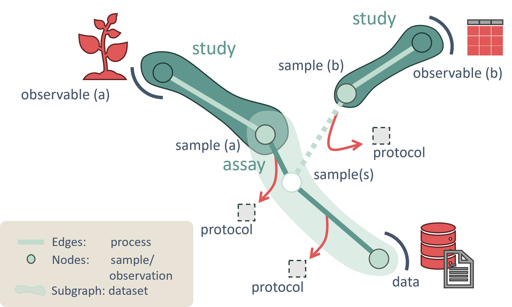
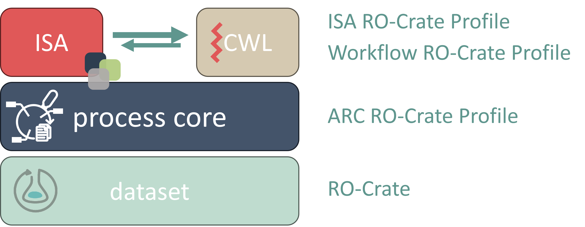

# ARC RO-Crate profile

[Latest version](profile//arc-ro-crate-profile.md)

The ARC RO-Crate profile aims to extend basic RO-Crate by elevating it from merely documenting research objects to providing a full, interconnected representation of the research process, from data generation to analysis, making it a powerful tool for tracing and reproducing scientific investigations.

In its core, the ARC-profile consists of detailed descriptions of the processes that lead to the generation of the data. For this, the [LabProcess](https://bioschemas.org/types/LabProcess/0.1-DRAFT) type is used, connecting [inputs](https://schema.org/object) with [outputs](https://schema.org/result) and [parametrization](https://bioschemas.org/types/LabProcess/0.1-DRAFT#parameterValue) of the steps. By carefully annotating the [dataset](https://schema.org/Dataset) using these processes, a complete process graph can be modeled. Consumers of the dataset can understand properties about the annotated [data entities](https://schema.org/MediaObject) by traversing this process graph.

On top of the generic LabProcess, the ARC-profile implements the [ISA-profile](https://github.com/nfdi4plants/isa-ro-crate-profile) for annotation of biological workflows and the [ARC-CWL-profile](https://github.com/nfdi4plants/arc-cwl-ro-crate-profile) for annotation of computational workflows. Both of these profiles are tied together in the ARC profile by the shared usage of the LabProcess:

- [ISA](https://isa-specs.readthedocs.io/en/latest/isamodel.html) (Investigation, Study, Assay) is a widely used metadata model for annotation of biological experiments.

- [CWL](https://www.commonwl.org/specification/) (Common Workflow Language) is a description model for specifying how to run and orchestrate command line tools and other executables

