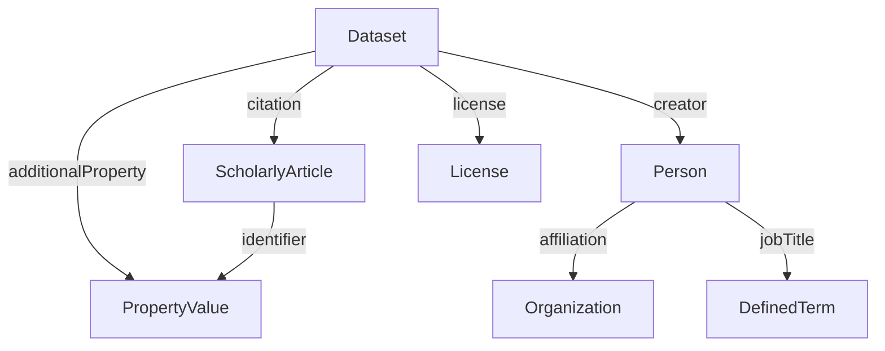

# ISA RO-Crate Profile

* **Table of contents**
  * [Overview](#overview)
  * [Requirements](#requirements)
    * [Dataset](#dataset)
    * [Person](#person)
    * [ScholarlyArticle](#scholarlyarticle)
    * [DefinedTerm](#definedterm)
    * [PropertyValue](#propertyvalue)
      * [PropertyValue - Parameter](#propertyvalue---parameter)
      * [PropertyValue - Characteristic](#propertyvalue---characteristic)
      * [PropertyValue - Factor](#propertyvalue---factor)
      * [PropertyValue - Component](#propertyvalue---component)
      * [PropertyValue - DOI](#propertyvalue---doi)
      * [PropertyValue - PubMedID](#propertyvalue---pubmedid)
  * [Example ro-crate-metadata.json](#example-ro-crate-metadatajson)

## Overview


The aim of the profile is to be able to provide administrative provenance information about a dataset in a structured way. The profile is based on the [Schema.org](https://schema.org/) vocabulary and provides a set of properties that can be used to describe the dataset, its creators, and related publications.

The following graph summarizes the Administrative Metadata model in terms of [Schema.org](https://schema.org/) vocabulary:



## Example ro-crate-metadata.json

_TODO: simple example and a link to a more complete example_

```json
```

## Requirements

### Dataset

| Property | Required | Expected Type | Description |
|----------|----------|---------------|-------------|
|@id|MUST|Text or URL|Should be “./”, the dataset object represents the root data entity.|
|@type|MUST|Text|MUST be '[schema.org/Dataset](https://schema.org/Dataset)'|
|additionalType|COULD|Text or URL|Decorator to identify it as a specialized dataset Investigation|
|identifier|MUST|Text or URL|Identifying descriptor of the dataset (e.g. repository name).|
|name|MUST|Text|A title of the dataset (e.g. a paper title).|
|description|MUST|Text|A description of the dataset (e.g. an abstract).|
|license|MUST|Text or URL|The license under which the RO-Crate may be used. When no license information is available on crate creation, use the default string `'ALL RIGHTS RESERVED BY THE AUTHORS'` |
|creator|SHOULD|[schema.org/Person](#person)|The creator(s)/authors(s)/owner(s)/PI(s) of the dataset.|
|hasPart|COULD|[schema.org/Dataset](https://schema.org/Dataset) | See RO-Crate specification.|
|citation|COULD|[schema.org/ScholarlyArticle](#scholarlyarticle)|Publications corresponding with this dataset.|
| additionalProperty|COULD|[schema.org/PropertyValue](#propertyvalue)|Additional properties of the dataset.|
|datePublished|COULD|DateTime|When the dataset was published. If the dataset is not (yet) published, use the date of the crate creation as default value.|
|dateCreated|COULD|DateTime|When the dataset was created|
|dateModified|COULD|DateTime|When the dataset was last modified|

### Person

Person associated with the dataset.

| Property | Required | Expected Type | Description |
|----------|----------|---------------|-------------|
|@id|MUST|Text or URL||
|@type |MUST|Text|MUST be '[schema.org/Person](https://schema.org/Person)'|
|givenName|MUST|Text|Given name of a person. Can be used for any type of name.|
|affiliation|SHOULD|[schema.org/Organization](https://schema.org/Organization)||
|email|SHOULD|Text||
|familyName|SHOULD|Text|Family name of a person.|
|identifier|SHOULD|Text or URL or [schema.org/PropertyValue](#propertyvalue)|One or many identifiers for this person, e.g. an ORCID. Can be of type PropertyValue to indicate the kind of reference.|
|jobTitle|SHOULD|[schema.org/DefinedTerm](#definedterm)||
|additionalName|COULD|Text||
|address|COULD|PostalAddress or Text||
|telephone|COULD|Text||

### ScholarlyArticle

Textual publication associated with the dataset.

| Property | Required | Expected Type | Description |
|----------|----------|---------------|-------------|
|@id|MUST|Text or URL||
|@type |MUST|Text|MUST be '[schema.org/ScholarlyArticle](https://schema.org/ScholarlyArticle)'|
|headline|MUST|Text||
|identifier|MUST|Text or URL or [schema.org/PropertyValue](#propertyvalue)|One or many identifiers for this article like a DOI or PubMedID. Can be of type PropertyValue to indicate the kind of reference (See details in Section on PropertyValue).|
|author|SHOULD|[schema.org/Person](#person)||
|creativeWorkStatus|COULD|[schema.org/DefinedTerm](#definedterm)|The status of the publication in terms of its stage in a lifecycle.|
|comment|COULD|[schema.org/Comment](#comment)|Comment|

### DefinedTerm

Single ontology term.

| Property | Required | Expected Type | Description |
|----------|----------|---------------|-------------|
|@id|MUST|Text or URL||
|@type |MUST|Text|MUST be '[schema.org/DefinedTerm](https://schema.org/DefinedTerm)'|
|name|MUST|Text|The term name.|
|termCode|SHOULD|Text|The identifier within the ontology.|
|inDefinedTermSet|COULD|URL or [schema.org/DefinedTermSet](https://schema.org/DefinedTermSet)|Link to the ontology.|

### PropertyValue

General profile for key-value pairs. It is based on [schema.org/PropertyValue](https://schema.org/PropertyValue).

| Property | Required | Expected Type | Description |
|----------|----------|---------------|-------------|
|@id|MUST|Text or URL||
|@type |MUST|Text|MUST be '[schema.org/PropertyValue](https://schema.org/PropertyValue)'|
|name|MUST|Text|Key name|
|value|SHOULD|Text|Value text or number|
|propertyID|SHOULD|URL|Key ontology reference|
|additionalType|Could|Text|Can be used to further clarify the type of this property|
|unitCode|COULD|URL|Unit ontology reference|
|unitText|COULD|Text|Unit name|
|valueReference|COULD|URL|Value ontology reference|

#### PropertyValue - DOI

If a [schema.org/PropertyValue](https://schema.org/PropertyValue) object represents a [DOI](https://www.doi.org/) identifier of an article, it is supposed to have the following exact values:

| Property | Required | Required Value | Description |
|----------|----------|---------------|-------------|
|name|MUST|'DOI'||
|value|SHOULD|-|The DOI without the 'https://www.doi.org' prefix|
|propertyID|MUST|'http://purl.obolibrary.org/obo/OBI_0002110'|Ontology term describing a DOI|

#### PropertyValue - PubMedID

If a [schema.org/PropertyValue](https://schema.org/PropertyValue) object represents a [PubMedID](https://pubmed.ncbi.nlm.nih.gov/) identifier of an article, it is supposed to have the following exact values:

| Property | Required | Required Value | Description |
|----------|----------|---------------|-------------|
|name|MUST|'PubMedID'||
|value|SHOULD|-|The PubMedID|
|propertyID|MUST|'http://purl.obolibrary.org/obo/OBI_0001617'|Ontology term describing a PubMedID|

