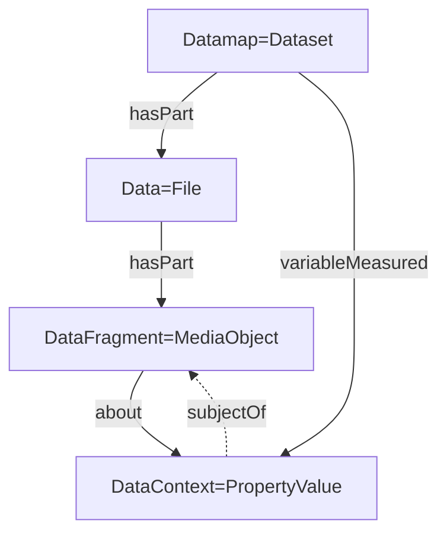

# ARC Datamap RO-Crate profile

## Abstract

This profile shows the intended representation of the ARC datamap in the RO-Crate. The datamap contains contextual information for fragments within data files. Data files are already referenced in their respective datasets through `hasPart`. We extend this by splitting data files into data fragments (using the same type `MediaObject` for the fragments and connecting them through `hasPart`). 

Furthermore, we add the contextual information per entry in the datamap to the `Dataset` objects. The fragments and their information then reference each other.

See our peer-reviewed publication for more information on the datamap and its usage: [Fragment-level FAIRness](https://doi.org/10.1515/jib-2025-0052)

## Detailed Description

We use `MediaObject` for data fragments and annotate them through the `variableMeasured` property in the `Dataset` object. Specifically, we plan the following:
- Each entry in the datamap becomes one entry in `variableMeasured` of type `PropertyValue`.
- Each data fragment becomes an object of type `MediaObject`, referenced from its file object through `hasPart`.
- The data fragments from the data map point to descriptions in form of a `PropertyValue` through the `about` property.
- The `PropertyValue` objects point back through `subjectOf`.

### Dataset

Object containing and annotating data files and fragments. 

In the context of ISA and specifically ARCs, these will mostly be [Assays](https://github.com/nfdi4plants/isa-ro-crate-profile/blob/release/profile/isa_ro_crate.md#assay) or [Studies](https://github.com/nfdi4plants/isa-ro-crate-profile/blob/release/profile/isa_ro_crate.md#assay) and follow the respective profiles.

| Property | Required | Expected Type | Description |
|----------|----------|---------------|-------------|
|@type |MUST|Text|Must be '[schema.org/Dataset](https://schema.org/Dataset)'|
|@id|MUST|Text or URL|Should be a subdirectory corresponding to this dataset.|
|about|MUST|[bioschemas.org/LabProcess](https://bioschemas.org/LabProcess)|The experimental processes performed in this dataset. If used in ISA or ARC contect, it must follow the [LabProcess profile](https://github.com/nfdi4plants/isa-ro-crate-profile/blob/release/profile/isa_ro_crate.md#labprocess)|
|hasPart|SHOULD|[File](https://schema.org/MediaObject)|The data files resulting from the processes performed in this dataset.|
|variableMeasured|COULD|Text or [schema.org/PropertyValue](https://schema.org/PropertyValue)|A fragment description entry from the datamap as a [PropertyValue](https://schema.org/PropertyValue) following the [fragment description profile](#fragment-description).|

### Data (File)

Describes and points to a Data file, and maps to the [ISA-JSON Data](https://isa-specs.readthedocs.io/en/latest/isajson.html#data-schema-json)

| Property | Required | Expected Type | Description |
|----------|----------|---------------|-------------|
|@type |MUST|Text|Must be 'File' or 'MediaObject'|
|@id|MUST|Text or URL|Should be the path pointing to the file./
|name|MUST|Text or URL|The name of the file.|
|comment|COULD|[schema.org/Comment](https://schema.org/Comment)|Comment|
|encodingFormat|COULD|Text of URL|Media format as a MIME type|
|disambiguatingDescription|COULD|Text|The type of the data file (“Raw Data File", “Derived Data File" or "Image File").|
|hasPart|COULD|[File](https://schema.org/MediaObject)|The data fragments within this file. They must follow the [Data Fragment profile](#data-fragment).|

### Data Fragment

Describes and points to a *Fragment* of a Data file. Doesn't have a correspondence in ISA.

| Property | Required | Expected Type | Description |
|----------|----------|---------------|-------------|
|@type |MUST|Text|Must be 'File' or 'MediaObject'|
|@id|MUST|Text or URL|Should be the path pointing to the file with a [fragment selector](https://www.w3.org/TR/annotation-model/#selectors) attached.|
|usageInfo|MUST|Text of URL|(Formal) Description of the fragment selector.|
|about|SHOULD|[schema.org/PropertyValue](https://schema.org/PropertyValue)|The fragment description for this fragment. It must follow the [fragment description profile](#fragment-description).|
|pattern|SHOULD|DefinedTerm|Defines the shape or format of entries in this fragment.|
|name|COULD|Text or URL|The name of the file.|
|comment|COULD|[schema.org/Comment](https://schema.org/Comment)|Comment|
|encodingFormat|COULD|Text of URL|Media format as a MIME type|
|disambiguatingDescription|COULD|Text|The type of the data file (“Raw Data File", “Derived Data File" or "Image File").|

### Fragment Description

Adds further annotation to a *Fragment* of a Data file. Doesn't have a correspondence in ISA.

| Property | Required | Expected Type | Description |
|----------|----------|---------------|-------------|
|@type |MUST|Text|Must be '[schema.org/PropertyValue](https://schema.org/PropertyValue)'|
|@id|MUST|Text or URL||
|name|MUST|Text|Must be "FragmentDescriptor"|
|propertyID|MUST|URL|Must be "https://github.com/nfdi4plants/ARC-specification/blob/dev/ISA-XLSX.md#datamap-table-sheets"|
|subjectOf|MUST|URL|Reference to the described data fragement using a [fragment selector](https://www.w3.org/TR/annotation-model/#selectors), following the [data fragment profile](#data-fragment).|
|value|SHOULD|Text|Explication of the data fragment contents|
|valueReference|SHOULD|URL|Value ontology reference|
|unitText|SHOULD|Text|Unit of the data fragment|
|unitCode|SHOULD|URL|Unit ontology reference|
|alternateName|SHOULD|Text|The label of the fragment, e.g. a column header.|
|measurementMethod|SHOULD|Text|Name of the tool used to create the data.|
|description|SHOULD|Text|Can be used to describe further details of the fragment|