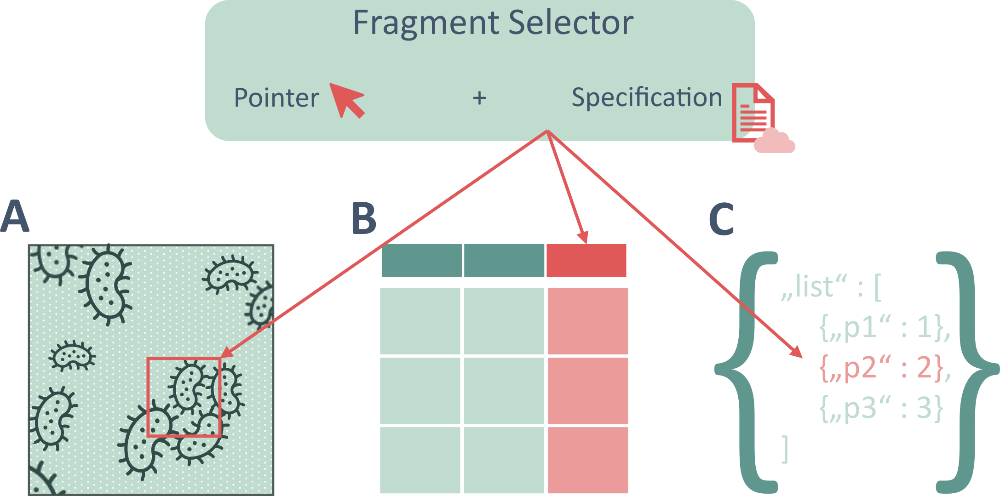
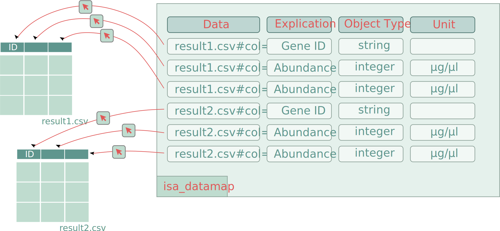
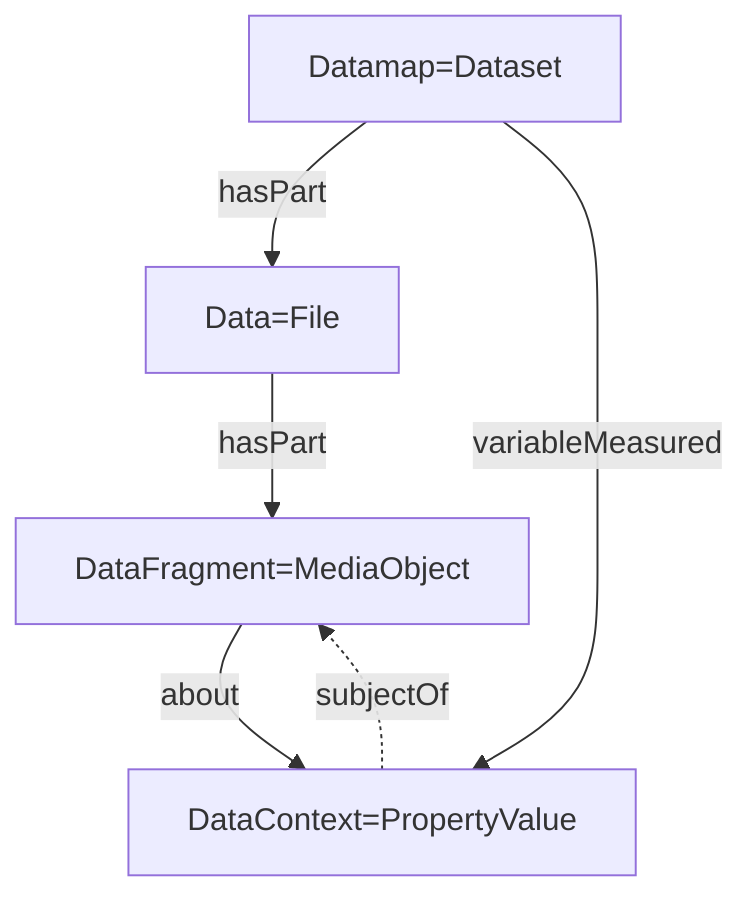

# ARC Datamap RO-Crate profile

* Version: 0.1
<!-- * Permalink: <https://w3id.org/ro/wfrun/process/0.5> -->
* Authors: [ARC RO-Crate community](./../../../index.md/#authors)
* License: [MIT License](https://mit-license.org/)
* Example conforming crate: [ro-crate-metadata.json](../../../examples/datamap_crate/ro-crate-metadata.json)
* Profile Crate: [ro-crate-metadata.json](ro-crate-metadata.json)
* Extends:
  - [RO-Crate 1.2 specification](https://w3id.org/ro/crate/1.2)
* JSON-LD context: <https://www.researchobject.org/ro-terms/arc/context.jsonld>
* Vocabulary terms:  <https://w3id.org/ro/terms/arc#>

* **Table of contents**
  * [Overview](#overview)
  * [Example ro-crate-metadata.json](#example-ro-crate-metadatajson)
  * [Requirements](#requirements)
    * [Dataset](#dataset)
    * [Data File](#data-file)
    * [Data Fragment](#data-fragment)
    * [Fragment Description](#fragment-description)


## Overview

This profile shows the intended representation of the ARC datamap in the RO-Crate. The datamap contains contextual information for fragments within data files. Data files are already referenced in their respective datasets through `hasPart`. We extend this by splitting data files into data fragments (using the same type `MediaObject` for the fragments and connecting them through `hasPart`). 



Furthermore, we add the contextual information per entry in the datamap to the `Dataset` objects. The fragments and their information then reference each other.



See our peer-reviewed publication for more information on the datamap and its usage: [Fragment-level FAIRness](https://doi.org/10.1515/jib-2025-0052)

## Detailed Description

We use `MediaObject` for data fragments and annotate them through the `variableMeasured` property in the `Dataset` object. Specifically, we plan the following:
- Each entry in the datamap becomes one entry in `variableMeasured` of type `PropertyValue`.
- Each data fragment becomes an object of type `MediaObject`, referenced from its file object through `hasPart`.
- The data fragments from the data map point to descriptions in form of a `PropertyValue` through the `about` property.
- The `PropertyValue` objects point back through `subjectOf`.



## Example Metadata File (`ro-crate-metadata.json`)


* [ro-crate-metadata.json](../../../examples/datamap_crate/ro-crate-metadata.json)
<!-- * [ro-crate-preview.html](../../../examples/datamap_crate/ro-crate-preview.html) -->

```json
{
  "@context": [
    "https://w3id.org/ro/crate/1.2/context",
    {
      "Sample": "https://bioschemas.org/Sample",
      "LabProtocol": "https://bioschemas.org/LabProtocol",
      "LabProcess": "https://bioschemas.org/LabProcess",
      "computationalTool": "https://bioschemas.org/properties/computationalTool",
      "labEquipment": "https://bioschemas.org/properties/labEquipment",
      "reagent": "https://bioschemas.org/properties/reagent",
      "intendedUse": "https://bioschemas.org/properties/intendedUse",
      "executesLabProtocol": "https://bioschemas.org/properties/executesLabProtocol",
      "parameterValue": "https://bioschemas.org/properties/parameterValue",
      "columnIndex": "https://w3id.org/ro/terms/arc#columnIndex"
    }
  ],
  "@graph": [
    {
      "@id": "http://purl.obolibrary.org/obo/NCIT_C45253",
      "@type": "DefinedTerm",
      "name": "string",
      "termCode": "http://purl.obolibrary.org/obo/NCIT_C45253"
    },
    {
      "@id": "processed_data.csv#col=1",
      "@type": "File",
      "name": "processed_data.csv#col=1",
      "encodingFormat": "text/csv",
      "usageInfo": "https://datatracker.ietf.org/doc/html/rfc7111",
      "pattern": {
        "@id": "http://purl.obolibrary.org/obo/NCIT_C45253"
      },
      "about": {
        "@id": "#Descriptor_processed_data.csv#col=1"
      }
    },
    {
      "@id": "http://purl.obolibrary.org/obo/NCIT_C48150",
      "@type": "DefinedTerm",
      "name": "float",
      "termCode": "http://purl.obolibrary.org/obo/NCIT_C48150"
    },
    {
      "@id": "processed_data.csv#col=2",
      "@type": "File",
      "name": "processed_data.csv#col=2",
      "encodingFormat": "text/csv",
      "usageInfo": "https://datatracker.ietf.org/doc/html/rfc7111",
      "pattern": {
        "@id": "http://purl.obolibrary.org/obo/NCIT_C48150"
      },
      "about": {
        "@id": "#Descriptor_processed_data.csv#col=2"
      }
    },
    {
      "@id": "processed_data.csv#col=3",
      "@type": "File",
      "name": "processed_data.csv#col=3",
      "encodingFormat": "text/csv",
      "usageInfo": "https://datatracker.ietf.org/doc/html/rfc7111",
      "pattern": {
        "@id": "http://purl.obolibrary.org/obo/NCIT_C48150"
      },
      "about": {
        "@id": "#Descriptor_processed_data.csv#col=3"
      }
    },
    {
      "@id": "processed_data.csv",
      "@type": "File",
      "name": "processed_data.csv",
      "encodingFormat": "text/csv",
      "hasPart": [
        {
          "@id": "processed_data.csv#col=1"
        },
        {
          "@id": "processed_data.csv#col=2"
        },
        {
          "@id": "processed_data.csv#col=3"
        }
      ]
    },
    {
      "@id": "#Descriptor_processed_data.csv#col=1",
      "@type": "PropertyValue",
      "name": "FragmentDescriptor",
      "value": "Protein identifier",
      "propertyID": "https://github.com/nfdi4plants/ARC-specification/blob/dev/ISA-XLSX.md#datamap-table-sheets",
      "valueReference": "http://purl.obolibrary.org/obo/NCIT_C165059",
      "alternateName": "protID",
      "subjectOf": {
        "@id": "processed_data.csv#col=1"
      }
    },
    {
      "@id": "#Descriptor_processed_data.csv#col=2",
      "@type": "PropertyValue",
      "name": "FragmentDescriptor",
      "value": "molecule count",
      "propertyID": "https://github.com/nfdi4plants/ARC-specification/blob/dev/ISA-XLSX.md#datamap-table-sheets",
      "unitCode": "http://purl.obolibrary.org/obo/NCIT_C68892",
      "unitText": "Millimole per Kilogram",
      "valueReference": "http://purl.obolibrary.org/obo/UO_0000192",
      "alternateName": "quant1",
      "subjectOf": {
        "@id": "processed_data.csv#col=2"
      }
    },
    {
      "@id": "#Descriptor_processed_data.csv#col=3",
      "@type": "PropertyValue",
      "name": "FragmentDescriptor",
      "value": "molecule count",
      "propertyID": "https://github.com/nfdi4plants/ARC-specification/blob/dev/ISA-XLSX.md#datamap-table-sheets",
      "unitCode": "http://purl.obolibrary.org/obo/NCIT_C68892",
      "unitText": "Millimole per Kilogram",
      "valueReference": "http://purl.obolibrary.org/obo/UO_0000192",
      "alternateName": "quant2",
      "subjectOf": {
        "@id": "processed_data.csv#col=3"
      }
    },
    {
      "@id": "LICENSE",
      "@type": "CreativeWork",
      "text": "ALL RIGHTS RESERVED BY THE AUTHORS"
    },
    {
      "@id": "./",
      "@type": "Dataset",
      "description": "An example of a ROCrate with a datamap, including annotation of a tabular data file.",
      "name": "ARC Datamap Crate Example",
      "hasPart": {
        "@id": "processed_data.csv"
      },
      "variableMeasured": [
        {
          "@id": "#Descriptor_processed_data.csv#col=1"
        },
        {
          "@id": "#Descriptor_processed_data.csv#col=2"
        },
        {
          "@id": "#Descriptor_processed_data.csv#col=3"
        }
      ],
      "dateCreated": "2026-06-25T22:58:40.2416018",
      "license": {
        "@id": "LICENSE"
      }
    },
    {
      "@id": "ro-crate-metadata.json",
      "@type": "CreativeWork",
      "conformsTo": {
        "@id": "https://w3id.org/ro/crate/1.2"
      },
      "about": {
        "@id": "./"
      }
    }
  ]
}
```

## Requirements

### Dataset

Object containing and annotating data files and fragments. In the context of this profile, this object is used to represent the datamap and its entries.

| Property | Required | Expected Type | Description |
|----------|----------|---------------|-------------|
|@type |MUST|Text|Must be '[schema.org/Dataset](https://schema.org/Dataset)'|
|@id|MUST|Text or URL|Should be a subdirectory corresponding to this dataset.|
|hasPart|SHOULD|[File](https://schema.org/MediaObject)|The data files resulting from the processes performed in this dataset.|
|variableMeasured|COULD|Text or [schema.org/PropertyValue](https://schema.org/PropertyValue)|A fragment description entry from the datamap as a [PropertyValue](https://schema.org/PropertyValue) following the [fragment description profile](#fragment-description).|


### Data (File)

Describes and points to a Data file.

| Property | Required | Expected Type | Description |
|----------|----------|---------------|-------------|
|@type |MUST|Text|Must be 'File' or 'MediaObject'|
|@id|MUST|Text or URL|Should be the path pointing to the file./
|name|MUST|Text or URL|The name of the file.|
|comment|COULD|[schema.org/Comment](https://schema.org/Comment)|Comment|
|encodingFormat|COULD|Text of URL|Media format as a MIME type|
|hasPart|COULD|[File](https://schema.org/MediaObject)|The data fragments within this file. They must follow the [Data Fragment profile](#data-fragment).|

### Data Fragment

Describes and points to a *Fragment* of a Data file. In addition to the filepath, the `@id` property must contain a [fragment selector](https://www.w3.org/TR/annotation-model/#selectors)(separated by a `#`) to point to the specific fragment within the file. The specifcation describing the fragment selector should be provided in the `usageInfo` property.

| Property | Required | Expected Type | Description |
|----------|----------|---------------|-------------|
|@type |MUST|Text|Must be 'File' or 'MediaObject'|
|@id|MUST|Text or URL|Should be the path pointing to the file with a [fragment selector](https://www.w3.org/TR/annotation-model/#selectors) attached.|
|usageInfo|MUST|Text of URL|(Formal) Description of the fragment selector.|
|about|SHOULD|[schema.org/PropertyValue](https://schema.org/PropertyValue)|The fragment description for this fragment. It must follow the [fragment description profile](#fragment-description).|
|pattern|SHOULD|DefinedTerm|Defines the shape or format of entries in this fragment.|
|name|COULD|Text or URL|The name of the file.|
|comment|COULD|[schema.org/Comment](https://schema.org/Comment)|Comment|
|encodingFormat|COULD|Text of URL|Media format as a MIME type|

### Fragment Description

Adds further annotation to a *Fragment* of a Data file. 

| Property | Required | Expected Type | Description |
|----------|----------|---------------|-------------|
|@type |MUST|Text|Must be '[schema.org/PropertyValue](https://schema.org/PropertyValue)'|
|@id|MUST|Text or URL||
|name|MUST|Text|Must be "FragmentDescriptor"|
|propertyID|MUST|URL|TO-DO?|
|subjectOf|MUST|URL|Reference to the described data fragement using a [fragment selector](https://www.w3.org/TR/annotation-model/#selectors), following the [data fragment profile](#data-fragment).|
|value|SHOULD|Text|Explication of the data fragment contents|
|valueReference|SHOULD|URL|Value ontology reference|
|unitText|SHOULD|Text|Unit of the data fragment|
|unitCode|SHOULD|URL|Unit ontology reference|
|alternateName|SHOULD|Text|The label of the fragment, e.g. a column header.|
|measurementMethod|SHOULD|Text|Name of the tool used to create the data.|
|description|SHOULD|Text|Can be used to describe further details of the fragment|