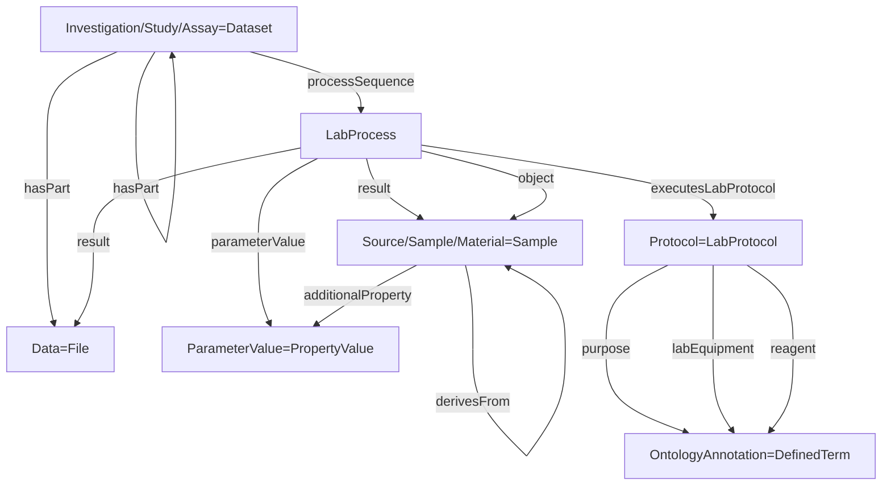

# ISA RO-Crate Profile

* Version: 1.0.0-draft.1
* Permalink: _coming soon_
* Authors
  * Florian Wetzels - https://orcid.org/0000-0002-5526-7138
  * Lukas Weil - https://orcid.org/0000-0003-1945-6342
  * Kevin Schneider - https://orcid.org/0000-0002-2198-5262
  * Sebastian Beier - https://orcid.org/0000-0002-2177-8781
  * Stuart Owen - https://orcid.org/0000-0003-2130-0865
  * Timo Muehlhaus - https://orcid.org/0000-0003-3925-6778
* **Table of contents**
  * [Overview](#overview)
  * [Requirements](#requirements)
    * [Investigation](#investigation)
    * [Study](#study)
    * [Assay](#assay)
    * [LabProcess](#labprocess)
    * [LabProtocol](#labprotocol)
    * [Sample](#sample)
    * [Data](#data)
    * [Person](#person)
    * [ScholarlyArticle](#scholarlyarticle)
    * [Comment](#comment)
    * [DefinedTerm](#definedterm)
    * [PropertyValue](#propertyvalue)
      * [PropertyValue - Parameter](#propertyvalue---parameter)
      * [PropertyValue - Characteristic](#propertyvalue---characteristic)
      * [PropertyValue - Factor](#propertyvalue---factor)
      * [PropertyValue - Component](#propertyvalue---component)
      * [PropertyValue - DOI](#propertyvalue---doi)
      * [PropertyValue - PubMedID](#propertyvalue---pubmedid)
  * [Example ro-crate-metadata.json](#example-ro-crate-metadatajson)

## Overview

The ISA RO-Crate profile is an instantiation of the [Administrative Crate](../administrative_crate/index.md) and [Process Core Crate](../process_core_crate/index.md) profiles to describe datasets following the Investigation-Study-Assay ([ISA](https://isa-tools.org/index.html)) model.
In particular, it describes a nested collection of datasets, all following the Process Core Crate profile.
Each datset in the collection uses Administrative Crate vocabulary to describe its administrative information, with the top-level dataset (Investigation) precisely following the Administrative Crate profile.

A significant part of the previous work on this [RO-Crate](https://www.researchobject.org/ro-crate/) profile for [ISA](https://isa-tools.org/index.html) was produced as part of the [Annotated Research Context (ARC)](https://nfdi4plants.org/content/learn-more/annotated-research-context.html) project, through [arc-to-rocrate](https://github.com/nfdi4plants/arc-to-rocrate).

During the [ELIXIR Biohackathon 2023](https://biohackathon-europe.org/), as part of [Project 14: Enabling continuous RDM using Annotated Research Contexts with RO-Crate profiles for ISA](https://github.com/elixir-europe/biohackathon-projects-2023/tree/main/14),
the profile was further fine tuned and defined, and some remaining unresolved mappings resolved.

The aim of the profile is to be able to fully represent [ISA-JSON](https://isa-specs.readthedocs.io/en/latest/isajson.html) as RO-Crate, fully capturing the metadata and files in a non-lossy form such that it
should be possible to convert between one to the other, in either direction, without loss of information.

The ISA RO-Crate has led to a few changes to [Bioschemas](https://bioschemas.org/) types:
  
**LabProtocol** - Has been redefined as a child of [HowTo](https://schema.org/HowTo) to make it clearer that it is intended to specifically describe the planned instructions for a lab process.

**LabProcess** - A new type has been defined as a child of [Action](https://schema.org/Action), to specifically describe the details and outcomes of an executed LabProtocol.
Thereby separating the "what was planned" and "what happened" between LabProtocol and LabProcess respectively.
A working group is working on the new type and adaptations of existing types.

An important change to the [Bioschemas](https://bioschemas.org/) specification that is still pending is the following:

**Dataset** - A new property _processSequence_ to describe how the Dataset was created.

The following graph summarizes the ISA model in terms of [Bioschemas](https://bioschemas.org/)/[Schema.org](https://schema.org/) vocabulary:

## Requirements

### Investigation

Is based upon [schema.org/Dataset](https://schema.org/Dataset) and maps to the [ISA-JSON Investigation](https://isa-specs.readthedocs.io/en/latest/isajson.html#investigation-schema-json).
A dataset following this profile also follows the [Administrative Crate](../administrative_crate/index.md) profile.
In particular, the Investigation object MUST follow the [Dataset profile](../administrative_crate/index.md#dataset) defined in the Administrative Crate profile with the following adaptions and additions to the properties defined in that profile.

| Property | Required | Expected Type | Description |
|----------|----------|---------------|-------------|
|@id|MUST|Text or URL|Should be “./”, the investigation object represents the root data entity.|
|additionalType|MUST|Text or URL|‘Investigation’ or ontology term to identify it as an Investigation|
|datePublished|MUST|DateTime|When the Investigation was published. If the Investigation is not (yet) published, use the date of the crate creation as default value.|
|dateCreated|SHOULD|DateTime|When the Investigation was created|
|hasPart|SHOULD|[schema.org/Dataset](https://schema.org/Dataset) ([Study](#study) or [Assay](#assay))|An Investigation object should contain other datasets representing the _studies_ of the investigation. The dataset objects in this list MUST follow the [Study profile](#study) or the [Assay profile](#assay) defined in this document.|
|comment|COULD|[schema.org/Comment](#comment)|Comment|
|mentions|COULD|[schema.org/DefinedTermSet](https://schema.org/DefinedTermSet)|Ontologies referenced in this investigation.|
|url|COULD|URL|The filename or path of the metadata file describing the investigation. Optional, since in some contexts like an ARC the filename is implicit.|

### Study

Is based upon [schema.org/Dataset](https://schema.org/Dataset) and maps to the [ISA-JSON Study](https://isa-specs.readthedocs.io/en/latest/isajson.html#study-schema-json).
A dataset following this profile also follows the [Process Core Crate](../process_core_crate/index.md) profile.
In particular, the Study object MUST follow the [Process Core Crate Dataset profile](../process_core_crate/index.md#dataset) and the [Administrative Crate Dataset profile](../administrative_crate/index.md#dataset) with the following adaptions and additions to the properties defined in that profile.

| Property | Required | Expected Type | Description |
|----------|----------|---------------|-------------|
|@id|MUST|Text or URL|Should be a subdirectory corresponding to this study.|
|additionalType|MUST|Text or URL|‘Study’ or ontology term to identify it as a Study|
|creator|SHOULD|[schema.org/Person](#person)|The performer of the study.|
|dateCreated|SHOULD|DateTime|When the Study was created|
|license|COULD|Text or URL| - |
|datePublished|SHOULD|DateTime|When the Study was published|
|description|SHOULD|Text|A short description of the study (e.g. an abstract).|
|hasPart|SHOULD|[schema.org/Dataset](https://schema.org/Dataset) ([Assay](#assay)) or [File](https://schema.org/MediaObject)|Assays contained in this study or actual data files resulting from the process sequence.|
|comment|COULD|[schema.org/Comment](#comment)|Comment|
|url|COULD|URL|The filename or path of the metadata file describing the study. Optional, since in some contexts like an ARC the filename is implicit.|

### Assay

Is based upon [schema.org/Dataset](https://schema.org/Dataset) and maps to the [ISA-JSON Assay](https://isa-specs.readthedocs.io/en/latest/isajson.html#assay-schema-json).
A dataset following this profile also follows the [Process Core Crate](../process_core_crate/index.md) profile.
In particular, the Assay object MUST follow the [Process Core Crate Dataset profile](../process_core_crate/index.md#dataset) and the [Administrative Crate Dataset profile](../administrative_crate/index.md#dataset) with the following adaptions and additions to the properties defined in that profile.

| Property | Required | Expected Type | Description |
|----------|----------|---------------|-------------|
|@id|MUST|Text or URL|Should be a subdirectory corresponding to this assay.|
|additionalType|MUST|Text or URL|‘Assay’ or ontology term to identify it as an Assay|
|identifier|MUST|Text or URL|Identifying descriptor of the assay.|
|name|SHOULD|Text|A title of the assay.|
|description|SHOULD|Text|A short description of the assay (e.g. an abstract).|
|hasPart|SHOULD|[File](https://schema.org/MediaObject)|The data files resulting from the process sequence. MUST not be used to directly point to data fragments.|
|license|COULD|Text or URL| - |
|measurementMethod|SHOULD|URL or [schema.org/DefinedTerm](#definedterm)|Describes the type measurement e.g Complexomics or Transcriptomics as an ontology term|
|measurementTechnique|SHOULD|URL or [schema.org/DefinedTerm](#definedterm)|Describes the type of technology used to take the measurement, e.g mass spectrometry or deep sequencing|
|comment|COULD|[schema.org/Comment](#comment)|Comment|
|url|COULD|URL|The filename or path of the metadata file describing the assay. Optional, since in some contexts like an ARC the filename is implicit.|
|variableMeasured|COULD|Text or [schema.org/PropertyValue](#propertyvalue)|The target variable being measured, e.g protein concentration|

### LabProcess

Has the new Bioschemas DRAFT [bioschemas.org/LabProcess](https://bioschemas.org/LabProcess) type and maps to the [ISA-JSON Process](https://isa-specs.readthedocs.io/en/latest/isajson.html#process-schema-json).
An ISA Process MUST follow the [Process profile](../process_core_crate/index.md#process) defined in the Process Core Crate profile, with the following additions to the properties defined in that profile.

| Property | Required | Expected Type | Description |
|----------|----------|---------------|-------------|
|agent|SHOULD|[schema.org/Person](#person)|The performer|
|endTime|SHOULD|DateTime||
|disambiguatingDescription|COULD|Text|Comments|

### LabProtocol

Is based on the Bioschemas [bioschemas.org/LabProtocol](https://bioschemas.org/LabProtocol) type and maps to the [ISA-JSON Protocol](https://isa-specs.readthedocs.io/en/latest/isajson.html#protocol-schema-json).
An ISA Protocol MUST follow the [Protocol profile](../process_core_crate/index.md#protocol) defined in the Process Core Crate profile.

### Sample

Is based on the Bioschemas [bioschemas.org/Sample](https://bioschemas.org/Sample) type, and represents the ISA-JSON [Sample](https://isa-specs.readthedocs.io/en/latest/isajson.html#sample-schema-json),
[Source](https://isa-specs.readthedocs.io/en/latest/isajson.html#source-schema-json) and [Material](https://isa-specs.readthedocs.io/en/latest/isajson.html#material-schema-json).
An ISA Sample MUST follow the [Sample profile](../process_core_crate/index.md#sample) defined in the Process Core Crate profile.

### Data

Describes and points to a Data file or a segment of a Data file (via [data fragment selectors](https://www.w3.org/TR/annotation-model/#fragment-selector)), and maps to the [ISA-JSON Data](https://isa-specs.readthedocs.io/en/latest/isajson.html#data-schema-json).
An ISA Data object MUST follow the [Data profile](../process_core_crate/index.md#data) defined in the Process Core Crate profile, with the following additions to the properties defined in that profile.

| Property | Required | Expected Type | Description |
|----------|----------|---------------|-------------|
|comment|COULD|[schema.org/Comment](#comment)|Comment|
|disambiguatingDescription|COULD|Text|The type of the data file (“Raw Data File", “Derived Data File" or "Image File").|

### Person

It is based on [schema.org/Person](https://schema.org/Person), and maps to the [ISA-JSON Person](https://isa-specs.readthedocs.io/en/latest/isajson.html#person-schema-json).
An ISA Person MUST follow the [Person profile](../administrative_crate/index.md#person) defined in the Administrative Crate profile.
Addionally, the following properties are defined for the ISA RO-Crate profile to describe a person in more detail.

| Property | Required | Expected Type | Description |
|----------|----------|---------------|-------------|
|disambiguatingDescription|COULD|Text||
|faxNumber|COULD|Text||

### ScholarlyArticle

It is based on [schema.org/ScholarlyArticle](https://schema.org/ScholarlyArticle) and maps to the [ISA-JSON Publication](https://isa-specs.readthedocs.io/en/latest/isajson.html#publication-schema-json).
An ISA ScholarlyArticle MUST follow the [ScholarlyArticle profile](../administrative_crate/index.md#scholarlyarticle) defined in the Administrative Crate profile.
Additionally, the following properties are defined for the ISA RO-Crate profile to describe a scholarly article in more detail.

| Property | Required | Expected Type | Description |
|----------|----------|---------------|-------------|
|comment|COULD|[schema.org/Comment](#comment)|Comment|

### Comment

It is based on [schema.org/Comment](https://schema.org/Comment) and maps to the [ISA-JSON Comment](https://isa-specs.readthedocs.io/en/latest/isajson.html#comment-schema-json)

| Property | Required | Expected Type | Description |
|----------|----------|---------------|-------------|
|@id|MUST|Text or URL||
|@type |MUST|Text|MUST be '[schema.org/Comment](https://schema.org/Comment)'|
|name|SHOULD|Text||
|text|SHOULD|Text||

### DefinedTerm

It is based on [schema.org/DefinedTerm](https://schema.org/DefinedTerm) and maps to the [ISA-JSON OntologyAnnotation](https://isa-specs.readthedocs.io/en/latest/isajson.html#ontology-annotation-schema-json).
An ISA DefinedTerm MUST follow the [DefinedTerm profile](../administrative_crate/index.md#definedterm) defined in the Administrative Crate profile, with the following additions to the properties defined in that profile.

| Property | Required | Expected Type | Description |
|----------|----------|---------------|-------------|
|disambiguatingDescription|COULD|Text|ISA comments|

### PropertyValue

General profile for key-value pairs. It is based on [schema.org/PropertyValue](https://schema.org/PropertyValue).
ISA PropertyValue objects, in general, MUST follow the [PropertyValue profile](../administrative_crate/index.md#propertyvalue) defined in the Administrative Crate profile.

#### PropertyValue - Parameter

Represents a process parameter. It is based on [schema.org/PropertyValue](https://schema.org/PropertyValue) and maps to the ISA-JSON Key-Value-Unit Triples [Process Parameter Value](https://isa-specs.readthedocs.io/en/latest/isajson.html#process-parameter-value-schema-json).
An ISA process parameter MUST follow the [PropertyValue profile](../administrative_crate/index.md#propertyvalue) defined in the Administrative Crate profile, with the following additions to the properties defined in that profile.

| Property | Required | Expected Type | Description |
|----------|----------|---------------|-------------|
|additionalType|MUST|Text|MUST be `"ParameterValue"`|

#### PropertyValue - Characteristic

Represents a characteristic. It is based on [schema.org/PropertyValue](https://schema.org/PropertyValue) and maps to the ISA-JSON Key-Value-Unit Triple [Material Attribute Value](https://isa-specs.readthedocs.io/en/latest/isajson.html#material-attribute-value-schema-json).
ISA characteristics MUST follow the [PropertyValue profile](../administrative_crate/index.md#propertyvalue) defined in the Administrative Crate profile, with the following additions to the properties defined in that profile.

| Property | Required | Expected Type | Description |
|----------|----------|---------------|-------------|
|additionalType|MUST|Text|MUST be `"CharacteristicValue"`|

#### PropertyValue - Factor

Represents a factor. It is based on [schema.org/PropertyValue](https://schema.org/PropertyValue) and maps to the ISA-JSON Key-Value-Unit Triple [Factor Value](https://isa-specs.readthedocs.io/en/latest/isajson.html#factor-value-schema-json).
An ISA factor MUST follow the [PropertyValue profile](../administrative_crate/index.md#propertyvalue) defined in the Administrative Crate profile, with the following additions to the properties defined in that profile.

| Property | Required | Expected Type | Description |
|----------|----------|---------------|-------------|
|additionalType|MUST|Text|MUST be `"FactorValue"`|

#### PropertyValue - Component

Represents a protocol component. It is based on [schema.org/PropertyValue](https://schema.org/PropertyValue) and maps to the a component of an [ISA-JSON protocol](https://isa-specs.readthedocs.io/en/latest/isajson.html#protocol-schema-json).
An ISA protocol component MUST follow the [PropertyValue profile](../administrative_crate/index.md#propertyvalue) defined in the Administrative Crate profile, with the following additions to the properties defined in that profile.

| Property | Required | Expected Type | Description |
|----------|----------|---------------|-------------|
|additionalType|MUST|Text|MUST be `"Component"`|

#### PropertyValue - DOI

If a [schema.org/PropertyValue](https://schema.org/PropertyValue) object represents a [DOI](https://www.doi.org/) identifier of an article, it is supposed to have the exact values described in the [PropertyValue - DOI](../administrative_crate/index.md#propertyvalue---doi) section of the Administrative Crate profile.

#### PropertyValue - PubMedID

If a [schema.org/PropertyValue](https://schema.org/PropertyValue) object represents a [PubMedID](https://pubmed.ncbi.nlm.nih.gov/) identifier of an article, it is supposed to have the exact values described in the [PropertyValue - PubMedID](../administrative_crate/index.md#propertyvalue---pubmedid) section of the Administrative Crate profile.

## Example ro-crate-metadata.json

_TODO: simple example and a link to a more complete example_