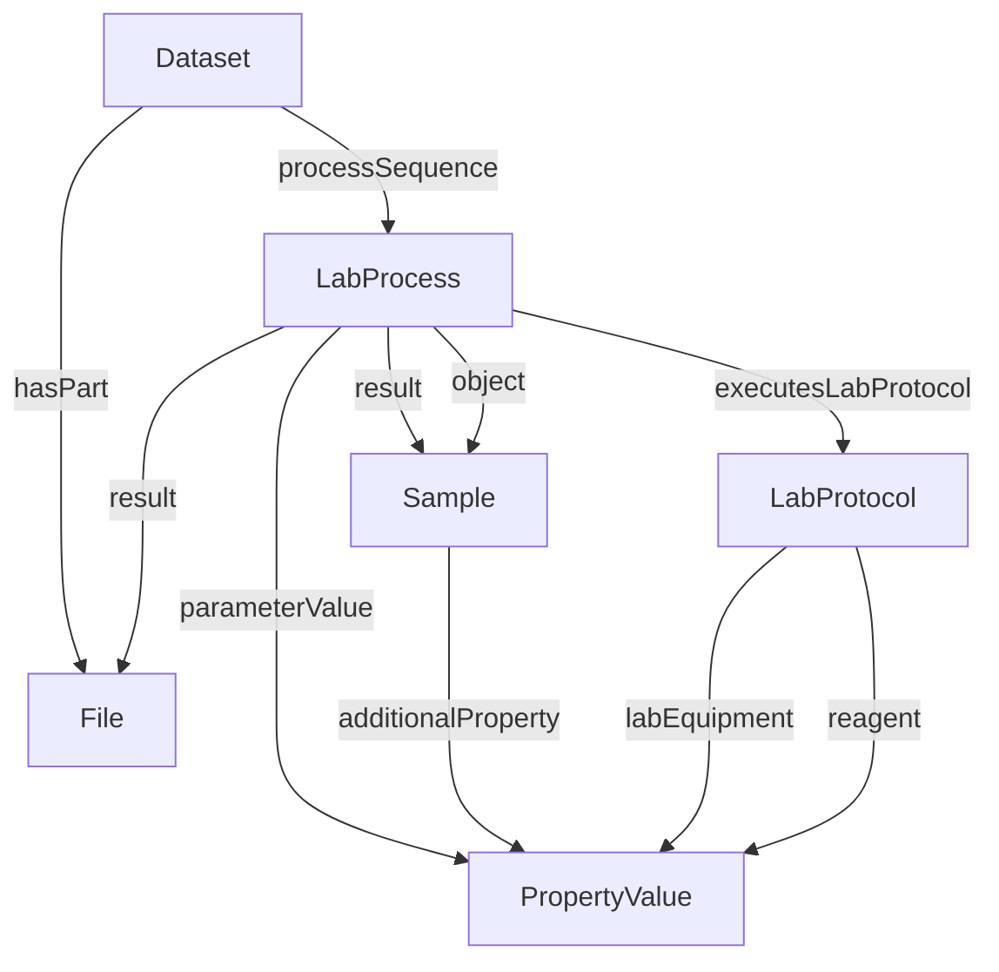
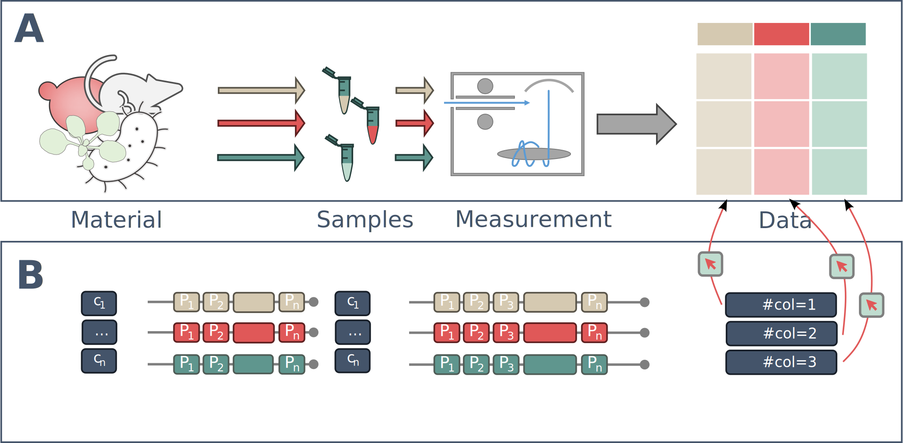

# ARC Process Core Crate

* Version: 0.1
<!-- * Permalink: <https://w3id.org/ro/wfrun/process/0.5> -->
* Authors: [ARC RO-Crate community](./../../../index.md/#authors)
* License: [MIT License](https://mit-license.org/)
* Example conforming crate: [ro-crate-metadata.json](../../../examples/process_core_crate/ro-crate-metadata.json)
* Profile Crate: [ro-crate-metadata.json](ro-crate-metadata.json)
* Extends:
  - [RO-Crate 1.2 specification](https://w3id.org/ro/crate/1.2)
* JSON-LD context: <https://www.researchobject.org/ro-terms/arc/context.jsonld>
* Vocabulary terms:  <https://w3id.org/ro/terms/arc#>

This profile uses terminology from the [RO-Crate 1.2 specification](https://w3id.org/ro/crate/1.2), and [extends it](https://www.researchobject.org/ro-crate/specification/1.2/appendix/jsonld.html#extending-ro-crate) with additional terms from the [ARC](https://github.com/ResearchObject/ro-terms/tree/master/arc) ro-terms and [Bioschemas](https://bioschemas.org/) namespace.

* **Table of contents**
  * [Overview](#overview)
  * [Example ro-crate-metadata.json](#example-ro-crate-metadatajson)
  * [Requirements](#requirements)
    * [Dataset](#dataset)
    * [LabProcess](#labprocess)
    * [LabProtocol](#labprotocol)
    * [Sample](#sample)
    * [Data](#data)
  * [Processes as graph edges](#processes-as-graph-edges)
  * [Data Fragment-level annotation](#data-fragment-level-annotation)


## Overview

The aim of the profile is to be able to fully represent [ISA-JSON](https://isa-specs.readthedocs.io/en/latest/isajson.html) as RO-Crate, fully capturing the metadata and files in a non-lossy form such that it
should be possible to convert between one to the other, in either direction, without loss of information.

The profile relies on types from [Bioschemas](https://bioschemas.org/) types:
  
**LabProtocol** - A child of [HowTo](https://schema.org/HowTo) to make it clearer that it is intended to specifically describe the planned instructions for upcoming lab processes.

**LabProcess** - A child of [Action](https://schema.org/Action), to specifically describe the details and outcomes of an executed LabProtocol.
Thereby separating the "what was planned" and "what happened" between LabProtocol and LabProcess respectively.
A working group is working on the new type and adaptations of existing types.

The following graph summarizes the Process Core model in terms of [Bioschemas](https://bioschemas.org/)/[Schema.org](https://schema.org/) vocabulary:




## Example Metadata File (`ro-crate-metadata.json`)

* [ro-crate-metadata.json](../../../examples/process_core_crate/ro-crate-metadata.json)
<!-- * [ro-crate-preview.html](../../../examples/process_core_crate/ro-crate-preview.html) -->

<!-- Remember to update above as well as below! -->

```json
{
  "@context": [
    "https://w3id.org/ro/crate/1.2/context",
    {
      "Sample": "https://bioschemas.org/Sample",
      "LabProtocol": "https://bioschemas.org/LabProtocol",
      "LabProcess": "https://bioschemas.org/LabProcess",
      "computationalTool": "https://bioschemas.org/properties/computationalTool",
      "labEquipment": "https://bioschemas.org/properties/labEquipment",
      "reagent": "https://bioschemas.org/properties/reagent",
      "intendedUse": "https://bioschemas.org/properties/intendedUse",
      "executesLabProtocol": "https://bioschemas.org/properties/executesLabProtocol",
      "parameterValue": "https://bioschemas.org/properties/parameterValue",
      "columnIndex": "https://w3id.org/ro/terms/arc#columnIndex"
    }
  ],
  "@graph": [
    {
      "@id": "datafile.wiff",
      "@type": "File",
      "name": "datafile.wiff"
    },
    {
      "@id": "#CharacteristicValue_organism_Arabidopsis_thaliana",
      "@type": "PropertyValue",
      "additionalType": "CharacteristicValue",
      "name": "organism",
      "value": "Arabidopsis thaliana",
      "propertyID": "https://bioregistry.io/OBI:0100026",
      "valueReference": "http://purl.obolibrary.org/obo/NCBITAXON_3702"
    },
    {
      "@id": "#Material_MyObservable",
      "@type": "Sample",
      "additionalType": "Material",
      "name": "MyObservable",
      "additionalProperty": {
        "@id": "#CharacteristicValue_organism_Arabidopsis_thaliana"
      }
    },
    {
      "@id": "#Sample_MySample",
      "@type": "Sample",
      "additionalType": "Sample",
      "name": "MySample"
    },
    {
      "@id": "#CharacteristicValue_Temperature_25",
      "@type": "PropertyValue",
      "additionalType": "CharacteristicValue",
      "name": "Temperature",
      "value": "25",
      "propertyID": "https://bioregistry.io/NCIT:C25206",
      "unitCode": "http://purl.obolibrary.org/obo/UO_0000027",
      "unitText": "degree Celsius"
    },
    {
      "@id": "#Process_Preparation",
      "@type": "LabProcess",
      "name": "Preparation",
      "object": {
        "@id": "#Material_MyObservable"
      },
      "result": {
        "@id": "#Sample_MySample"
      },
      "parameterValue": {
        "@id": "#CharacteristicValue_Temperature_25"
      }
    },
    {
      "@id": "#Process_Measurement",
      "@type": "LabProcess",
      "name": "Measurement",
      "object": {
        "@id": "#Sample_MySample"
      },
      "result": {
        "@id": "datafile.wiff"
      }
    },
    {
      "@id": "LICENSE",
      "@type": "CreativeWork",
      "text": "ALL RIGHTS RESERVED BY THE AUTHORS"
    },
    {
      "@id": "./",
      "@type": "Dataset",
      "description": "An example of a ROCrate with a core process model, including preparation and measurement processes.",
      "name": "Experimental ARC Process Core Crate Example",
      "hasPart": {
        "@id": "datafile.wiff"
      },
      "about": [
        {
          "@id": "#Process_Preparation"
        },
        {
          "@id": "#Process_Measurement"
        }
      ],
      "dateCreated": "2026-06-24T23:04:48.2431278",
      "license": {
        "@id": "LICENSE"
      }
    },
    {
      "@id": "ro-crate-metadata.json",
      "@type": "CreativeWork",
      "conformsTo": {
        "@id": "https://w3id.org/ro/crate/1.2"
      },
      "about": {
        "@id": "./"
      }
    }
  ]
}
```


## Requirements

### Dataset

[schema.org/Dataset](https://schema.org/Dataset) containing and contexualizing the processes.

| Property | Required | Expected Type | Description |
|----------|----------|---------------|-------------|
|@id|MUST|Text or URL|According to ROCrate specification.|
|@type|MUST|Text|MUST be '[schema.org/Dataset](https://schema.org/Dataset)'|
|about|SHOULD|[bioschemas.org/LabProcess](#labprocess)|The processes described here and possibly leading up to the files grouped in this dataset.|
|hasPart|COULD|[File](https://schema.org/MediaObject)|Data files resulting from the process sequence.|

### LabProcess

Has the new Bioschemas DRAFT [bioschemas.org/LabProcess](https://bioschemas.org/LabProcess) type and maps to the [ISA-JSON Process](https://isa-specs.readthedocs.io/en/latest/isajson.html#process-schema-json)

| Property | Required | Expected Type | Description |
|----------|----------|---------------|-------------|
|@id|MUST|Text or URL|Could identify the process using the isa metadata filename and the protocol reference or process name.|
|@type |MUST|Text|MUST be '[bioschemas.org/LabProcess](https://bioschemas.org/LabProcess)'|
|name|MUST|Text| -|
|object|SHOULD|[bioschemas.org/Sample](#sample) or [File](https://schema.org/MediaObject)|The input of the process. If there are multiple inputs, they SHOULD be stored as a sorted list to establish correspondence with outputs. (Both lists need the same length in that case.)|
|result|SHOULD|[bioschemas.org/Sample](#sample) or [File](https://schema.org/MediaObject)|The output of the process. If there are multiple outputs, they SHOULD be stored as a sorted list to establish correspondence with inputs. (Both lists need the same length in that case.)|
|executesLabProtocol|SHOULD|[bioschemas.org/LabProtocol](https://bioschemas.org/LabProtocol)|The protocol executed|
|parameterValue|SHOULD|[schema.org/PropertyValue](https://schema.org/PropertyValue) ([Parameter](#propertyvalue---parameter))|A parameter value of the experimental process, usually a key-value pair using ontology terms|

### LabProtocol

Is based on the Bioschemas [bioschemas.org/LabProtocol](https://bioschemas.org/LabProtocol) type and maps to the [ISA-JSON Protocol](https://isa-specs.readthedocs.io/en/latest/isajson.html#protocol-schema-json)  

| Property | Required | Expected Type | Description |
|----------|----------|---------------|-------------|
|@id|MUST|Text or URL|Could be the url pointing to the protocol resource.|
|@type |MUST|Text|MUST be '[bioschemas.org/LabProtocol](https://bioschemas.org/LabProtocol)'|
|description|SHOULD|Text|A short description of the protocol (e.g. an abstract)|
|intendedUse|SHOULD|[schema.org/DefinedTerm](#definedterm) or Text or URL|The protocol type as an ontology term|
|name|SHOULD|Text|Main title of the LabProtocol.|
|computationalTool|COULD|[schema.org/DefinedTerm](#definedterm) or [schema.org/PropertyValue](https://schema.org/PropertyValue) ([Component](#propertyvalue---component)) or [schema.org/SoftwareApplication](https://schema.org/SoftwareApplication)|Software or tool used as part of the lab protocol to complete a part of it.|
|labEquipment|COULD|[schema.org/DefinedTerm](#definedterm) or [schema.org/PropertyValue](https://schema.org/PropertyValue) ([Component](#propertyvalue---component)) or Text or URL|For LabProtocols it would be a laboratory equipment use by a person to follow one or more steps described in this LabProtocol.|
|reagent|COULD|[schema.org/BioChemEntity](https://schema.org/BioChemEntity://bioschemas.org/Sample) or [schema.org/DefinedTerm](#definedterm) or [schema.org/PropertyValue](https://schema.org/PropertyValue) ([Component](#propertyvalue---component)) or Text or URL|Reagents used in the protocol.|
|url|COULD|URL|Pointer to protocol resources external to the ISA-Tab that can be accessed by their Uniform Resource Identifier (URI).|
|version|COULD|Number or Text|An identifier for the version to ensure protocol tracking.|

### Sample

Is based on the Bioschemas [bioschemas.org/Sample](https://bioschemas.org/Sample) type, and represents the ISA-JSON [Sample](https://isa-specs.readthedocs.io/en/latest/isajson.html#sample-schema-json),
[Source](https://isa-specs.readthedocs.io/en/latest/isajson.html#source-schema-json) and [Material](https://isa-specs.readthedocs.io/en/latest/isajson.html#material-schema-json)

| Property | Required | Expected Type | Description |
|----------|----------|---------------|-------------|
|@id|MUST|Text or URL|Could be the unique sample name.|
|@type |MUST|Text|MUST be '[bioschemas.org/Sample](https://bioschemas.org/Sample)'|
|name|MUST|Text|A name identifying the sample.|
|additionalProperty|SHOULD|[schema.org/PropertyValue](https://schema.org/PropertyValue) ([Characteristic](#propertyvalue---characteristic) or [Factor](#propertyvalue---factor))|characteristics or factors|

### Data

Describes and points to a Data file or a segment of a Data file (via [data fragment selectors](https://www.w3.org/TR/annotation-model/#fragment-selector)), and maps to the [ISA-JSON Data](https://isa-specs.readthedocs.io/en/latest/isajson.html#data-schema-json)

| Property | Required | Expected Type | Description |
|----------|----------|---------------|-------------|
|@id|MUST|Text or URL|Should be the path pointing to the file|
|@type |MUST|Text|MUST be 'File' or 'MediaObject'|
|name|MUST|Text or URL|The name of the file.|
|comment|COULD|[schema.org/Comment](#comment)|Comment|
|disambiguatingDescription|COULD|Text|The type of the data file (“Raw Data File", “Derived Data File" or "Image File").|
|encodingFormat|COULD|Text of URL|Media format as a MIME type|
|hasPart|COULD|Text of URL|Data fragments of this Data object, described by [data fragment selectors](https://www.w3.org/TR/annotation-model/#fragment-selector). SHOULD not be used on data fragments.|
|usageInfo|COULD|Text of URL|Description/specification of the [data fragment selector](https://www.w3.org/TR/annotation-model/#fragment-selector), if the object describes a data fragment and a selector is present in the path/`@id`. SHOULD only be used on data fragments.|

Entities referenced by an processes's [object](http://schema.org/object) or [result](http://schema.org/result) SHOULD be of type `File` (an RO-Crate alias for [MediaObject](http://schema.org/MediaObject)) for files, [Dataset](http://schema.org/Dataset) for directories and [Collection](http://schema.org/Collection) for [multi-file datasets](#representing-multi-file-objects), but MAY be a [CreativeWork](http://schema.org/CreativeWork) for other types of data (e.g. an online database); they MAY be of type [PropertyValue](http://schema.org/PropertyValue) to capture numbers/strings that are not stored as files.

Data entities involved in an application's input and output SHOULD have an `@id` that reflects the original file or directory name as processed by the application, but MAY be renamed to avoid clashes with other entities in the crate. In this case, they SHOULD refer to the original name via [alternateName](http://schema.org/alternateName). This is particularly important to support reproducibility in cases where an application expects to find input in specific locations and with specific names (see the MIRAX example in [Representing multi-file objects](#representing-multi-file-objects)).


## Processes as graph edges


## Data Fragment-level annotation



```json
[
  {
    "@id": "raw_data1.wiff",
    "@type": "File",
    "name": "raw_data1.wiff"
  },
  {
    "@id": "raw_data2.wiff",
    "@type": "File",
    "name": "raw_data2.wiff"
  },
  {
    "@id": "processed_data.csv#col=1",
    "@type": "File",
    "name": "processed_data.csv#col=1",
    "encodingFormat": "text/csv",
    "usageInfo": "https://datatracker.ietf.org/doc/html/rfc7111"
  },
  {
    "@id": "processed_data.csv#col=2",
    "@type": "File",
    "name": "processed_data.csv#col=2",
    "encodingFormat": "text/csv",
    "usageInfo": "https://datatracker.ietf.org/doc/html/rfc7111"
  },
  {
    "@id": "#Process_DataProcessing_1",
    "@type": "LabProcess",
    "name": "DataProcessing_1",
    "object": {
      "@id": "raw_data1.wiff"
    },
    "result": {
      "@id": "processed_data.csv#col=1"
    }
  },
  {
    "@id": "#Process_DataProcessing_2",
    "@type": "LabProcess",
    "name": "DataProcessing_2",
    "object": {
      "@id": "raw_data2.wiff"
    },
    "result": {
      "@id": "processed_data.csv#col=2"
    }
  }
]
```

## Experimental process

```json
```


## Computational process


```json

```

## PropertyValue Annotations

```json

```