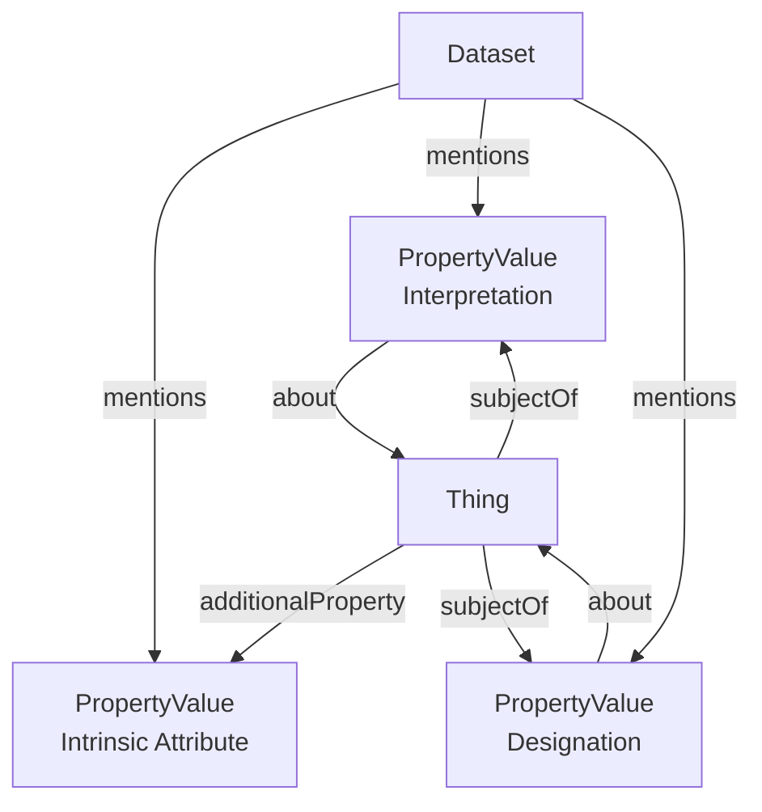

# Semantic Designation profile

* Version: 0.1
<!-- * Permalink: <https://w3id.org/ro/wfrun/process/0.5> -->
* Authors: [ARC RO-Crate community](./../../../index.md/#authors)
* License: [MIT License](https://mit-license.org/)
* Example conforming crate: [ro-crate-metadata.json](../../../examples/semantic_designation_crate/ro-crate-metadata.json)
* Profile Crate: [ro-crate-metadata.jsonld](ro-crate-metadata.jsonld)
* Extends:
  - [RO-Crate 1.2 specification](https://w3id.org/ro/crate/1.2)
* JSON-LD context: <https://www.researchobject.org/ro-terms/arc/context.jsonld>
* Vocabulary terms:  <https://w3id.org/ro/terms/arc#>

* **Table of contents**
  * [Overview](#overview)
  * [Example ro-crate-metadata.json](#example-ro-crate-metadatajson)
  * [Requirements](#requirements)
    * [Thing](#thing)
    * [Semantic Description](#semantic-description)
    * [Semantic Attribute](#semantic-attribute)


## Overview

This profile defines a consistent approach for describing semantic metadata associated with entities represented in an RO-Crate. These entities may be **data entities**, such as directories, files, or fragments of files, as well as **contextual entities**, such as physical samples, instruments, or other real-world objects represented in the crate.

The profile distinguishes three kinds of metadata according to their relationship with the entity they describe:

- **Intrinsic metadata** describes characteristics that are considered part of the entity itself. Examples include a file's format, a sample's mass, or the datatype associated with a measured value.
- **Interpretations** describe stable semantic meanings assigned to an entity or one of its components. For example, an interpretation may state that a particular table column represents a physical quantity such as temperature. Although such meanings are generally stable, they express how an entity is understood rather than a property of the entity itself.
- **Designations** describe roles, classifications, or other contextual assignments whose applicability depends on a particular activity, study, or dataset. For example, a designation may identify a sample as belonging to the control group of an experiment.

For the purpose of modeling semantic annotations in RO-Crate, this profile distinguishes between **intrinsic metadata** and **externally assigned metadata**. The latter comprises both **Interpretations** and **Designations**. This distinction is based on whether the metadata is considered an inherent property of the entity or an assignment made from an external perspective. Stability is treated as a separate concern: interpretations are generally stable, whereas designations are inherently context-dependent, yet both represent externally assigned metadata.

This conceptual distinction is reflected in the RO-Crate representation. Intrinsic metadata is modeled directly as attributes of the corresponding entity, whereas Interpretations and Designations are modeled as separate descriptor objects. Representing externally assigned metadata through descriptor objects makes their origin and scope explicit, while allowing the same entity to participate in multiple semantic or contextual descriptions without conflating those assignments with the entity's intrinsic properties.


## Detailed Description

Within this profile, any entity that can be described in an RO-Crate (i.e. a `Thing`) may be annotated using `PropertyValue` objects.

Intrinsic metadata is represented using `PropertyValue` objects linked from the annotated entity through the `additionalProperty` property. Such objects describe intrinsic characteristics of the entity itself.

Externally assigned metadata is represented using **Semantic Descriptors**, which are likewise encoded as `PropertyValue` objects. A descriptor is linked to the annotated entity through the `about` property, while the entity links back to the descriptor through the inverse `subjectOf` property. The descriptor type is indicated using `additionalType`, whose value is either `Interpretation` or `Designation`.

Every descriptor expresses a semantic annotation as a **semantic property** and an **assigned value**:

- The **semantic property** (`name` and optionally `propertyID`) identifies the kind of annotation being made, such as *physical quantity represented*, *experimental role*, or *replicate group*.
- The **assigned value** (`value` and optionally `valueReference`) specifies the value assigned for that semantic property. Depending on the annotation, this may be a concept, identifier, literal value, or another resource.

For interpretation descriptors, `unitText` and `unitCode` may additionally be used to specify the unit associated with the described entity. For example, if a file column is interpreted as representing temperature measurements, the descriptor may indicate that the values are expressed in degrees Celsius.

The profile recommends that all annotation entities (both intrinsic attributes and semantic descriptors) are referenced from the crate `Dataset` through the `mentions` property, making them explicitly discoverable within the crate.



## Example Metadata File (`ro-crate-metadata.json`)

* [ro-crate-metadata.json](../../../examples/semantic_designation_crate/ro-crate-metadata.json)

```json
{
  "@context": [
    "https://w3id.org/ro/crate/1.2/context",
    {
      "Sample": "https://bioschemas.org/Sample"
    }
  ],
  "@graph": [

    {
      "@id": "./",
      "@type": "Dataset",
      "name": "Semantic Designation Example",
      "mentions": [
        { "@id": "#mass" },
        { "@id": "#controlGroupDesignation" },
        { "@id": "#temperatureInterpretation" }
      ]
    },

    {
      "@id": "#sample1",
      "@type": "Sample",
      "name": "Sample 1",

      "additionalProperty": {
        "@id": "#mass"
      },

      "subjectOf": {
        "@id": "#controlGroupDesignation"
      }
    },

    {
      "@id": "#mass",
      "@type": "PropertyValue",

      "name": "mass",
      "propertyID": "http://purl.obolibrary.org/obo/PATO_0000125",

      "value": 2.3,
      "unitText": "g",
      "unitCode": "http://purl.obolibrary.org/obo/UO_0000021"
    },

    {
      "@id": "#controlGroupDesignation",
      "@type": "PropertyValue",

      "additionalType": "Designation",

      "about": {
        "@id": "#sample1"
      },

      "name": "experimental role",
      "propertyID": "TODO",

      "value": "control group",
      "valueReference": "http://purl.bioontology.org/ontology/MESH/D035061"
    },

    {
      "@id": "measurements.csv",
      "@type": "File",
      "name": "measurements.csv",
      "encodingFormat": "text/csv",

      "subjectOf": {
        "@id": "#temperatureInterpretation"
      }
    },

    {
      "@id": "#temperatureInterpretation",
      "@type": "PropertyValue",

      "additionalType": "Interpretation",

      "about": {
        "@id": "measurements.csv"
      },

      "name": "physical quantity represented",

      "value": "temperature",
      "valueReference": "http://purl.obolibrary.org/obo/PATO_0000146",

      "unitText": "°C",
      "unitCode": "http://purl.obolibrary.org/obo/UO_0000027"
    },

    {
      "@id": "ro-crate-metadata.json",
      "@type": "CreativeWork",
      "conformsTo": {
        "@id": "https://w3id.org/ro/crate/1.2"
      },
      "about": {
        "@id": "./"
      }
    }

  ]
}
```

## Requirements

### Dataset

RO-Crate `Dataset` entity containing semantically annotated entities.

| Property | Required | Expected Type | Description |
|----------|----------|---------------|-------------|
| `@type` | MUST | Text | MUST be [`schema:Dataset`](https://schema.org/Dataset). |
| `mentions` | SHOULD | [`schema:PropertyValue`](https://schema.org/PropertyValue) | References annotation entities represented as `PropertyValue` objects following either the [Semantic Descriptor](#semantic-descriptor) or [Semantic Attribute](#semantic-attribute) profile. |

---

### Thing

An entity that is semantically annotated.

| Property | Required | Expected Type | Description |
|----------|----------|---------------|-------------|
| `additionalProperty` | COULD | [`schema:PropertyValue`](https://schema.org/PropertyValue) | Intrinsic metadata of the entity. Each referenced `PropertyValue` MUST follow the [Semantic Attribute](#semantic-attribute) profile. |
| `subjectOf` | COULD | [`schema:PropertyValue`](https://schema.org/PropertyValue) | Externally assigned metadata describing the entity. Each referenced `PropertyValue` MUST follow the [Semantic Descriptor](#semantic-descriptor) profile. |

---

### Semantic Descriptor

A semantic descriptor represents externally assigned metadata about a `Thing`, such as an Interpretation or Designation.

| Property | Required | Expected Type | Description |
|----------|----------|---------------|-------------|
| `@id` | MUST | Text or URL | Identifier of the descriptor. |
| `@type` | MUST | Text | MUST be [`schema:PropertyValue`](https://schema.org/PropertyValue). |
| `additionalType` | SHOULD | Text | Indicates the descriptor type. SHOULD be either `Interpretation` or `Designation`. |
| `about` | MUST | [`schema:Thing`](https://schema.org/Thing) | The entity described by this descriptor. |
| `name` | MUST | Text | Human-readable name of the **semantic property** (e.g. *physical quantity represented*, *experimental role*, *replicate group*). |
| `propertyID` | SHOULD | URL | Ontology identifier of the semantic property. |
| `value` | SHOULD | Text, Number or Boolean | The **assigned value** for the semantic property. May be a literal value or a human-readable label. |
| `valueReference` | COULD | URL | Ontology identifier or URI corresponding to the assigned value. |
| `unitText` | COULD | Text | Unit associated with the described entity, where applicable. Primarily intended for Interpretation descriptors. |
| `unitCode` | COULD | URL | Ontology identifier corresponding to `unitText`. |
| `description` | COULD | Text | Additional information about the annotation. |

---

### Semantic Attribute

An intrinsic property of a `Thing`, represented as a `PropertyValue`.

| Property | Required | Expected Type | Description |
|----------|----------|---------------|-------------|
| `@id` | MUST | Text or URL | Identifier of the attribute. |
| `@type` | MUST | Text | MUST be [`schema:PropertyValue`](https://schema.org/PropertyValue). |
| `additionalType` | COULD | Text | May further specialize the attribute type. |
| `name` | MUST | Text | Human-readable name of the intrinsic property. |
| `propertyID` | SHOULD | URL | Ontology identifier of the intrinsic property. |
| `value` | SHOULD | Text, Number or Boolean | Value of the intrinsic property. |
| `valueReference` | COULD | URL | Ontology identifier or URI corresponding to the value. |
| `unitText` | COULD | Text | Unit of the intrinsic property value, where applicable. |
| `unitCode` | COULD | URL | Ontology identifier corresponding to `unitText`. |
| `description` | COULD | Text | Additional information about the intrinsic property. |