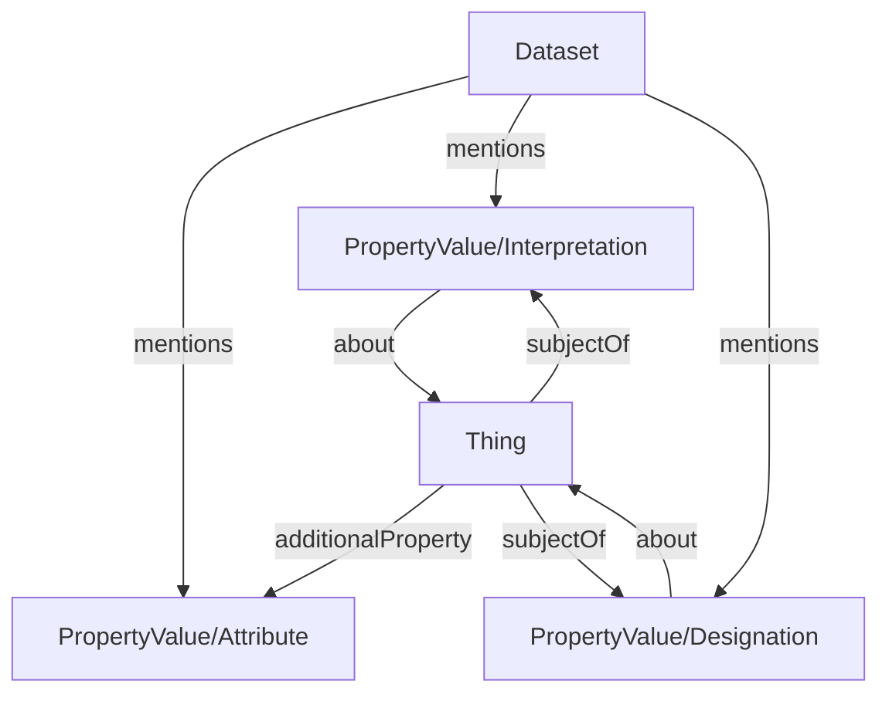

# Semantic Designation profile

* Version: 0.1
<!-- * Permalink: <https://w3id.org/ro/wfrun/process/0.5> -->
* Authors: [ARC RO-Crate community](./../../../index.md/#authors)
* License: [MIT License](https://mit-license.org/)
* Example conforming crate: [ro-crate-metadata.json](../../../examples/semantic_designation_crate/ro-crate-metadata.json)
* Profile Crate: [ro-crate-metadata.jsonld](ro-crate-metadata.jsonld)
* Extends:
  - [RO-Crate 1.2 specification](https://w3id.org/ro/crate/1.2)
* JSON-LD context: <https://www.researchobject.org/ro-terms/arc/context.jsonld>
* Vocabulary terms:  <https://w3id.org/ro/terms/arc#>

* **Table of contents**
  * [Overview](#overview)
  * [Example ro-crate-metadata.json](#example-ro-crate-metadatajson)
  * [Requirements](#requirements)
    * [Thing](#thing)
    * [Semantic Description](#semantic-description)
    * [Semantic Attribute](#semantic-attribute)


## Overview

This profile describes how to annotate semantic metadata associated with entities represented in an RO-Crate. These entities may be data entities, such as directories, files, or fragments of files, as well as contextual entities, such as physical samples, instruments, or other real-world objects represented in the crate.

The profile distinguishes three kinds of metadata according to their relationship with the entity they describe:

- *Intrinsic metadata* describes characteristics that are considered part of the entity itself. Examples include a file's format, a sample's mass, or the datatype associated with a measured value.
- *Interpretations* describe stable semantic meanings assigned to an entity or one of its components. For example, an interpretation may state that a particular table column represents temperature. Although such meanings are generally stable, they express how an entity is understood rather than a property of the entity itself.
- *Designations* describe roles, classifications, or other contextual assignments whose applicability depends on a particular activity, study, or dataset. For example, a designation may identify a sample as belonging to a control group in a particular experiment.

For the purpose of modeling annotations in RO-Crate, this profile distinguishes between intrinsic metadata and externally assigned metadata. The latter comprises both Interpretations and Designations. This distinction is based on whether the metadata is considered an inherent property of the entity or an assignment made from an external perspective. Stability is treated as a separate concern: interpretations are generally stable, whereas designations are inherently context-dependent, yet both represent metadata assigned to an entity rather than intrinsic to it.

This conceptual distinction is reflected in the RO-Crate representation. Intrinsic metadata is modeled directly as attributes of the corresponding entity, whereas Interpretations and Designations are modeled as separate descriptor objects. Representing externally assigned metadata through descriptor objects makes its origin and scope explicit, while allowing the same entity to participate in multiple semantic or contextual descriptions without conflating those assignments with the entity's inherent properties.

## Detailed Description

Within this generic profile, we consider the semantic annotation of any object in the crate, meaning a `Thing` in the RO-Crate context. The annotation objects themselves are represented through `PropertyValue` objects. Their relationship and interpretation depend on their type, i.e. whether they are internal metadata or external metadata.

If a `PropertyValue` object is used to describe an intrinsic property of a `Thing`, it is linked from the `Thing` through the `additionalProperty` attribute.
If a `PropertyValue` object represents a descriptor for external metadata, it links to the `Thing` through its `about` attribute, while the `Thing` links back through the inverse attribute `subjectOf`.
To indicate the type annotation, we use the `additionalType` attribute of the `PropertyValue` object, which can be either `Interpretation` or `Designation`. The following diagram illustrates the relationships between these objects.

The profile recommends to reference the annotation entities from the `Dataset` entity through the `mentions` attribute, to indicate that the dataset contains these annotations.



## Example Metadata File (`ro-crate-metadata.json`)


* [ro-crate-metadata.json](../../../examples/datamap_crate/ro-crate-metadata.json)
<!-- * [ro-crate-preview.html](../../../examples/datamap_crate/ro-crate-preview.html) -->

```json
{
  "@context": [
    "https://w3id.org/ro/crate/1.2/context",
    {
      "Sample": "https://bioschemas.org/Sample",
      "LabProtocol": "https://bioschemas.org/LabProtocol",
      "LabProcess": "https://bioschemas.org/LabProcess",
      "computationalTool": "https://bioschemas.org/properties/computationalTool",
      "labEquipment": "https://bioschemas.org/properties/labEquipment",
      "reagent": "https://bioschemas.org/properties/reagent",
      "intendedUse": "https://bioschemas.org/properties/intendedUse",
      "executesLabProtocol": "https://bioschemas.org/properties/executesLabProtocol",
      "parameterValue": "https://bioschemas.org/properties/parameterValue",
      "columnIndex": "https://w3id.org/ro/terms/arc#columnIndex"
    }
  ],
  "@graph": [
    {
      "@id": "http://purl.obolibrary.org/obo/NCIT_C45253",
      "@type": "DefinedTerm",
      "name": "string",
      "termCode": "http://purl.obolibrary.org/obo/NCIT_C45253"
    },
    {
      "@id": "processed_data.csv#col=1",
      "@type": "File",
      "name": "processed_data.csv#col=1",
      "encodingFormat": "text/csv",
      "usageInfo": "https://datatracker.ietf.org/doc/html/rfc7111",
      "pattern": {
        "@id": "http://purl.obolibrary.org/obo/NCIT_C45253"
      },
      "about": {
        "@id": "#Descriptor_processed_data.csv#col=1"
      }
    },
    {
      "@id": "http://purl.obolibrary.org/obo/NCIT_C48150",
      "@type": "DefinedTerm",
      "name": "float",
      "termCode": "http://purl.obolibrary.org/obo/NCIT_C48150"
    },
    {
      "@id": "processed_data.csv#col=2",
      "@type": "File",
      "name": "processed_data.csv#col=2",
      "encodingFormat": "text/csv",
      "usageInfo": "https://datatracker.ietf.org/doc/html/rfc7111",
      "pattern": {
        "@id": "http://purl.obolibrary.org/obo/NCIT_C48150"
      },
      "about": {
        "@id": "#Descriptor_processed_data.csv#col=2"
      }
    },
    {
      "@id": "processed_data.csv#col=3",
      "@type": "File",
      "name": "processed_data.csv#col=3",
      "encodingFormat": "text/csv",
      "usageInfo": "https://datatracker.ietf.org/doc/html/rfc7111",
      "pattern": {
        "@id": "http://purl.obolibrary.org/obo/NCIT_C48150"
      },
      "about": {
        "@id": "#Descriptor_processed_data.csv#col=3"
      }
    },
    {
      "@id": "processed_data.csv",
      "@type": "File",
      "name": "processed_data.csv",
      "encodingFormat": "text/csv",
      "hasPart": [
        {
          "@id": "processed_data.csv#col=1"
        },
        {
          "@id": "processed_data.csv#col=2"
        },
        {
          "@id": "processed_data.csv#col=3"
        }
      ]
    },
    {
      "@id": "#Descriptor_processed_data.csv#col=1",
      "@type": "PropertyValue",
      "name": "FragmentDescriptor",
      "value": "Protein identifier",
      "propertyID": "https://github.com/nfdi4plants/ARC-specification/blob/dev/ISA-XLSX.md#datamap-table-sheets",
      "valueReference": "http://purl.obolibrary.org/obo/NCIT_C165059",
      "alternateName": "protID",
      "subjectOf": {
        "@id": "processed_data.csv#col=1"
      }
    },
    {
      "@id": "#Descriptor_processed_data.csv#col=2",
      "@type": "PropertyValue",
      "name": "FragmentDescriptor",
      "value": "molecule count",
      "propertyID": "https://github.com/nfdi4plants/ARC-specification/blob/dev/ISA-XLSX.md#datamap-table-sheets",
      "unitCode": "http://purl.obolibrary.org/obo/NCIT_C68892",
      "unitText": "Millimole per Kilogram",
      "valueReference": "http://purl.obolibrary.org/obo/UO_0000192",
      "alternateName": "quant1",
      "subjectOf": {
        "@id": "processed_data.csv#col=2"
      }
    },
    {
      "@id": "#Descriptor_processed_data.csv#col=3",
      "@type": "PropertyValue",
      "name": "FragmentDescriptor",
      "value": "molecule count",
      "propertyID": "https://github.com/nfdi4plants/ARC-specification/blob/dev/ISA-XLSX.md#datamap-table-sheets",
      "unitCode": "http://purl.obolibrary.org/obo/NCIT_C68892",
      "unitText": "Millimole per Kilogram",
      "valueReference": "http://purl.obolibrary.org/obo/UO_0000192",
      "alternateName": "quant2",
      "subjectOf": {
        "@id": "processed_data.csv#col=3"
      }
    },
    {
      "@id": "LICENSE",
      "@type": "CreativeWork",
      "text": "ALL RIGHTS RESERVED BY THE AUTHORS"
    },
    {
      "@id": "./",
      "@type": "Dataset",
      "description": "An example of a ROCrate with a datamap, including annotation of a tabular data file.",
      "name": "ARC Datamap Crate Example",
      "hasPart": {
        "@id": "processed_data.csv"
      },
      "variableMeasured": [
        {
          "@id": "#Descriptor_processed_data.csv#col=1"
        },
        {
          "@id": "#Descriptor_processed_data.csv#col=2"
        },
        {
          "@id": "#Descriptor_processed_data.csv#col=3"
        }
      ],
      "dateCreated": "2026-06-25T22:58:40.2416018",
      "license": {
        "@id": "LICENSE"
      }
    },
    {
      "@id": "ro-crate-metadata.json",
      "@type": "CreativeWork",
      "conformsTo": {
        "@id": "https://w3id.org/ro/crate/1.2"
      },
      "about": {
        "@id": "./"
      }
    }
  ]
}
```

## Requirements

### Dataset

RO-Crate Dataset Entity that contains semantically annotated objects.

| Property | Required | Expected Type | Description |
|----------|----------|---------------|-------------|
|@type |MUST|Text|Must be '[schema.org/Dataset](https://schema.org/Dataset)'|
|mentions|SHOULD|[schema.org/PropertyValue](https://schema.org/PropertyValue)|An annotation enitity as a [PropertyValue](https://schema.org/PropertyValue) following the [semantic description profile](#semantic-description) or the [semantic attribute profile](#semantic-attribute).|


### Thing

Object to be semantically annotated.

| Property | Required | Expected Type | Description |
|----------|----------|---------------|-------------|
|additionalProperty|COULD|[schema.org/PropertyValue](https://schema.org/PropertyValue)|Ontology annotated properties of the object. Must follow the [semantic attribute profile](#semantic-attribute).|
|subjectOf|COULD|[schema.org/PropertyValue](https://schema.org/PropertyValue)|The semantic description for object. It must follow the [semantic descriptor profile](#semantic-descriptor).|

### Semantic Description

Adds external annotation to a `Thing`. 

| Property | Required | Expected Type | Description |
|----------|----------|---------------|-------------|
|@id|MUST|Text or URL||
|@type |MUST|Text|Must be '[schema.org/PropertyValue](https://schema.org/PropertyValue)'|
|additionalType|COULD|Text|Can be 'Interpretation' or 'Designation'.|
|name|MUST|Text|Description of what is annotated.|
|about|MUST|[schema.org/Thing](https://schema.org/Thing)|The described entity.|
|propertyID|SHOULD|URL|Ontology reference corresponding `name`.|
|value|COULD|Text|The annotated property.|
|valueReference|COULD|URL|Value ontology reference.|
|unitText|SHOULD|Text|Unit of the described entity.|
|unitCode|SHOULD|URL|Unit ontology reference.|
|description|SHOULD|Text|Can be used to describe further details of the annotation or the described entity.|

### Semantic Attribute

Generic, intrinsic attributes represented by key-value pairs.

| Property | Required | Expected Type | Description |
|----------|----------|---------------|-------------|
|@id|MUST|Text or URL||
|@type |MUST|Text|MUST be '[schema.org/PropertyValue](https://schema.org/PropertyValue)'|
|additionalType|COULD|Text|Can be used to further clarify the type of this property|
|name|MUST|Text|Key name/property name/attrbute name|
|value|SHOULD|Text|Value text or number|
|propertyID|SHOULD|URL|Key ontology reference|
|unitCode|COULD|URL|Unit ontology reference|
|unitText|COULD|Text|Unit of the value|
|valueReference|COULD|URL|Value ontology reference|
