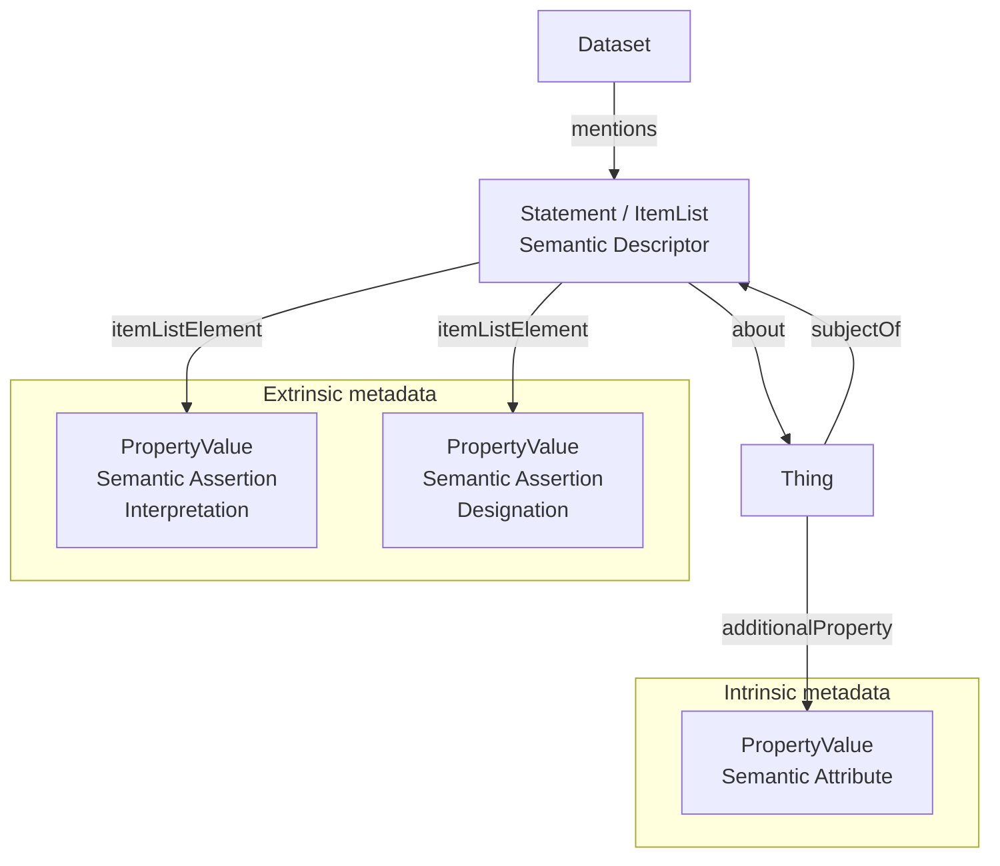

# Semantic Designation profile

* Version: 0.1
<!-- * Permalink: <https://w3id.org/ro/wfrun/process/0.5> -->
* Authors
  - Lukas Weil - https://orcid.org/0000-0003-1945-6342
  - Florian Wetzels - https://orcid.org/0000-0002-5526-7138
  - Timo Mühlhaus - https://orcid.org/0000-0003-3925-6778
  - Christoph Garth - https://orcid.org/0000-0003-1669-8549
* License: [MIT License](https://mit-license.org/)
* Example conforming crate: [ro-crate-metadata.json](../../../examples/semantic_designation_crate/ro-crate-metadata.json)
* Profile Crate: [ro-crate-metadata.jsonld](ro-crate-metadata.jsonld)
* Extends:
  - [RO-Crate 1.2 specification](https://w3id.org/ro/crate/1.2)
* JSON-LD context: https://www.researchobject.org/ro-terms/arc/context.jsonld
* Vocabulary terms: https://w3id.org/ro/terms/arc#

* **Table of contents**
- [Semantic Designation profile](#semantic-designation-profile)
  - [Overview](#overview)
  - [Detailed Description](#detailed-description)
    - [Semantic Attributes](#semantic-attributes)
    - [Semantic Assertions](#semantic-assertions)
    - [Semantic Descriptors](#semantic-descriptors)
  - [Example Metadata File (`ro-crate-metadata.json`)](#example-metadata-file-ro-crate-metadatajson)
  - [Requirements](#requirements)
    - [Dataset](#dataset)
    - [Thing](#thing)
    - [Semantic Attribute](#semantic-attribute)
    - [Semantic Assertion](#semantic-assertion)
    - [Semantic Descriptor](#semantic-descriptor)

## Overview

This profile defines a general approach for attaching semantic metadata to entities represented in an RO-Crate. The described entity may be a **data entity**, such as a file, directory, or part of a file, or a **contextual entity**, such as a physical sample, instrument, or other object represented in the crate.

At the conceptual level, the profile distinguishes two kinds of metadata according to how the metadata relates to the described entity:

- **Intrinsic metadata** is treated as a property of the entity itself. Examples include the mass of a sample, the format of a file, or the datatype of a value.
- **Extrinsic metadata** is asserted about the entity from an interpretive or contextual perspective. It does not describe a property that is modeled as belonging directly to the entity.

This distinction concerns how a statement is modeled in the crate rather than whether a property is intrinsically or permanently part of an object in an ontological sense.

Extrinsic metadata is further divided according to the function and stability of the assertion:

- An **Interpretation** states what an entity, component, or value represents or means. For example, an interpretation may state that a column in a table represents temperature measurements. Interpretations are generally intended to remain stable and valid independently of a particular experimental role, grouping, or other transient context.
- A **Designation** assigns a role, grouping, status, or other context-dependent classification to an entity. For example, a designation may state that a sample serves as a control in a particular experiment. Designations are inherently context-dependent and may therefore change or cease to apply when the relevant activity, study, dataset, or other context changes.

Stability is therefore independent of the distinction between intrinsic and extrinsic metadata. Both Interpretations and Designations are extrinsic because they are asserted from an external perspective; they differ in that Interpretations are intended to express relatively stable meaning, whereas Designations express context-dependent assignments.

At the representation level, the profile maps these conceptual distinctions to two kinds of `PropertyValue` objects:

- A **Semantic Attribute** represents one item of intrinsic metadata.
- A **Semantic Assertion** represents one item of extrinsic metadata. A Semantic Assertion is classified as either an `Interpretation` or a `Designation`.

Semantic Attributes and Semantic Assertions therefore represent individual metadata statements at the same structural level. Their distinction reflects whether the represented metadata is treated as intrinsic or extrinsic.

Semantic Attributes are linked directly from the described entity using `additionalProperty`. Semantic Assertions are represented separately from the entity so that the context and provenance of an extrinsic statement can be expressed explicitly.

For this purpose, the profile introduces a **Semantic Descriptor**. A Semantic Descriptor groups one or more Semantic Assertions about an entity, identifies the entity being described, and may provide contextual or provenance information about the contained assertions.

A Semantic Descriptor is therefore not another kind of semantic statement alongside Semantic Attributes and Semantic Assertions. Instead, it is a container that organizes and qualifies Semantic Assertions.

## Detailed Description

Within this profile, any entity that can be described in an RO-Crate may be semantically annotated. The described entity is referred to generally as a `Thing`.

Individual metadata statements are represented using `PropertyValue` objects. Depending on whether the statement represents intrinsic or extrinsic metadata, the `PropertyValue` is modeled as either a Semantic Attribute or a Semantic Assertion.

### Semantic Attributes

Intrinsic metadata is represented using **Semantic Attributes**.

A Semantic Attribute is a `PropertyValue` linked directly from the described entity through the `additionalProperty` property. It represents a property that is treated as belonging to the entity itself.

Each Semantic Attribute expresses a property and its value:

* `name`, and optionally `propertyID`, identify the property being described.
* `value`, and optionally `valueReference`, provide the value of that property.
* `unitText` and `unitCode` may specify the unit of the value where applicable.

For example, the mass of a sample may be represented by a Semantic Attribute whose property is `mass`, whose value is `2.3`, and whose unit is `g`.

### Semantic Assertions

Extrinsic metadata is represented using **Semantic Assertions**.

Like a Semantic Attribute, a Semantic Assertion is represented as a `PropertyValue`. Unlike an attribute, however, an assertion is not modeled as a property belonging directly to the described entity. Instead, it expresses a statement made about the entity from an interpretive or contextual perspective.

Each Semantic Assertion expresses a property and an asserted value:

* `name`, and optionally `propertyID`, identify the kind of statement being made, such as *physical quantity represented*, *experimental role*, or *replicate group*.
* `value`, and optionally `valueReference`, specify the value asserted for that property.

The kind of Semantic Assertion is indicated using `additionalType`:

* `Interpretation` indicates that the assertion describes what an entity, component, or value represents or means.

* `Designation` indicates that the assertion assigns a context-dependent role, grouping, status, or classification.

For example, an Interpretation may state that a column in a file represents temperature, while a Designation may state that a sample serves as a control in a particular experiment.

For Interpretations, `unitText` and `unitCode` may additionally be used to specify the unit associated with the interpreted quantity. For example, if a file column is interpreted as representing temperature measurements, the assertion may indicate that the represented values are expressed in degrees Celsius.

This use of a unit differs from its use in a Semantic Attribute. In a Semantic Attribute, the unit qualifies the attribute value itself. In an Interpretation, the unit qualifies the quantity represented by the described entity or component.

### Semantic Descriptors

Semantic Assertions are organized using **Semantic Descriptors**.

A Semantic Descriptor groups one or more Semantic Assertions concerning the same described entity. It is represented as an object with the types `Statement` and `ItemList`.

The descriptor:

* identifies the entity being described using `about`;
* contains its Semantic Assertions using `itemListElement`; and
* may provide contextual or provenance information about the annotation, such as its creator, creation date, name, or description.

The described entity may link back to the Semantic Descriptor using `subjectOf`.

The Semantic Descriptor therefore establishes the scope of its contained assertions and provides a place to record information about the annotation process itself. It does not constitute an additional semantic statement about the entity.

A single entity may participate in multiple Semantic Descriptors. This allows different interpretations or contextual designations to coexist without conflating them with the intrinsic properties of the entity or with each other.

The crate `Dataset` SHOULD reference Semantic Descriptors through the `mentions` property so that semantic annotations are explicitly discoverable from the root dataset.



## Example Metadata File (`ro-crate-metadata.json`)

* [ro-crate-metadata.json](../../../examples/semantic_designation_crate/ro-crate-metadata.json)

```json
{
  "@context": [
    "https://w3id.org/ro/crate/1.2/context",
    {
      "Sample": "https://bioschemas.org/Sample"
    }
  ],
  "@graph": [
    {
      "@id": "./",
      "@type": "Dataset",
      "name": "Semantic Designation Example",
      "mentions": [
        { "@id": "#semanticDescriptor1" },
        { "@id": "#semanticDescriptor2" }
      ]
    },
    {
      "@id": "#sample1",
      "@type": "Sample",
      "name": "Sample 1",
      "additionalProperty": {
        "@id": "#mass"
      },
      "subjectOf": {
        "@id": "#semanticDescriptor1"
      }
    },
    {
      "@id": "#semanticDescriptor1",
      "@type": [
        "Statement",
        "ItemList"
      ],
      "about": {
        "@id": "#sample1"
      },
      "itemListElement": [
        {
          "@id": "#controlGroupDesignation"
        }
      ]
    },
    {
      "@id": "#semanticDescriptor2",
      "@type": [
        "Statement",
        "ItemList"
      ],
      "about": {
        "@id": "measurements.csv"
      },
      "itemListElement": [
        {
          "@id": "#temperatureInterpretation"
        }
      ]
    },
    {
      "@id": "#mass",
      "@type": "PropertyValue",
      "name": "mass",
      "propertyID": "http://purl.obolibrary.org/obo/PATO_0000125",
      "value": 2.3,
      "unitText": "g",
      "unitCode": "http://purl.obolibrary.org/obo/UO_0000021"
    },
    {
      "@id": "#controlGroupDesignation",
      "@type": "PropertyValue",
      "additionalType": "Designation",
      "name": "experimental role",
      "propertyID": "TODO",
      "value": "control group",
      "valueReference": "http://purl.bioontology.org/ontology/MESH/D035061"
    },
    {
      "@id": "measurements.csv",
      "@type": "File",
      "name": "measurements.csv",
      "encodingFormat": "text/csv",
      "subjectOf": {
        "@id": "#semanticDescriptor2"
      }
    },
    {
      "@id": "#temperatureInterpretation",
      "@type": "PropertyValue",
      "additionalType": "Interpretation",
      "name": "physical quantity represented",
      "value": "temperature",
      "valueReference": "http://purl.obolibrary.org/obo/PATO_0000146",
      "unitText": "°C",
      "unitCode": "http://purl.obolibrary.org/obo/UO_0000027"
    },
    {
      "@id": "ro-crate-metadata.json",
      "@type": "CreativeWork",
      "conformsTo": {
        "@id": "https://w3id.org/ro/crate/1.2"
      },
      "about": {
        "@id": "./"
      }
    }
  ]
}
```

## Requirements

### Dataset

An RO-Crate `Dataset` containing semantically annotated entities.

| Property   | Required | Expected Type       | Description                                                                                                                                         |
| ---------- | -------- | ------------------- | --------------------------------------------------------------------------------------------------------------------------------------------------- |
| `@type`    | MUST     | Text                | MUST be [`schema:Dataset`](https://schema.org/Dataset).                                                                                             |
| `mentions` | SHOULD   | `[ "https://schema.org/Statement", "https://schema.org/ItemList" ]` | References Semantic Descriptors contained in the crate. Each referenced entity MUST follow the [Semantic Descriptor](#semantic-descriptor) profile. |

---

### Thing

An entity that is semantically described.

| Property             | Required | Expected Type                                              | Description                                                                                                                                                   |
| -------------------- | -------- | ---------------------------------------------------------- | ------------------------------------------------------------------------------------------------------------------------------------------------------------- |
| `additionalProperty` | MAY      | [`schema:PropertyValue`](https://schema.org/PropertyValue) | References intrinsic metadata of the entity. Each referenced `PropertyValue` MUST follow the [Semantic Attribute](#semantic-attribute) profile.               |
| `subjectOf`          | MAY      | `[ "https://schema.org/Statement", "https://schema.org/ItemList" ]` | References extrinsic metadata descriptions concerning the entity. Each referenced object MUST follow the [Semantic Descriptor](#semantic-descriptor) profile. |

---

### Semantic Attribute

A **Semantic Attribute** represents one item of intrinsic metadata about a `Thing`. It is represented as a `PropertyValue` and linked directly from the described entity through `additionalProperty`.

| Property         | Required | Expected Type            | Description                                                         |
| ---------------- | -------- | ------------------------ | ------------------------------------------------------------------- |
| `@id`            | MUST     | Text or URL              | Identifier of the attribute.                                        |
| `@type`          | MUST     | Text                     | MUST be [`schema:PropertyValue`](https://schema.org/PropertyValue). |
| `additionalType` | MAY      | Text or URL              | May further specialize the type of the attribute.                   |
| `name`           | MUST     | Text                     | Human-readable name of the represented property.                    |
| `propertyID`     | SHOULD   | URL                      | Ontology identifier or URI identifying the represented property.    |
| `value`          | SHOULD   | Text, Number, or Boolean | Value of the represented property.                                  |
| `valueReference` | MAY      | URL                      | Ontology identifier or URI corresponding to the value.              |
| `unitText`       | MAY      | Text                     | Unit of the value, where applicable.                                |
| `unitCode`       | MAY      | URL                      | Ontology identifier or URI corresponding to `unitText`.             |
| `description`    | MAY      | Text                     | Additional information about the attribute.                         |

---

### Semantic Assertion

A **Semantic Assertion** represents one item of extrinsic metadata about a `Thing`. It is represented as a `PropertyValue` and contained in a [Semantic Descriptor](#semantic-descriptor).

A Semantic Assertion is classified as either an **Interpretation** or a **Designation**.

| Property         | Required | Expected Type            | Description                                                                                                                             |
| ---------------- | -------- | ------------------------ | --------------------------------------------------------------------------------------------------------------------------------------- |
| `@id`            | MUST     | Text or URL              | Identifier of the assertion.                                                                                                            |
| `@type`          | MUST     | Text                     | MUST be [`schema:PropertyValue`](https://schema.org/PropertyValue).                                                                     |
| `additionalType` | SHOULD   | Text or URL              | Indicates the kind of assertion. SHOULD be either `Interpretation` or `Designation`.                                                    |
| `name`           | MUST     | Text                     | Human-readable name of the property being asserted, such as *physical quantity represented*, *experimental role*, or *replicate group*. |
| `propertyID`     | SHOULD   | URL                      | Ontology identifier or URI identifying the asserted property.                                                                           |
| `value`          | SHOULD   | Text, Number, or Boolean | Value asserted for the property. May be a literal value or a human-readable label.                                                      |
| `valueReference` | MAY      | URL                      | Ontology identifier or URI corresponding to the asserted value.                                                                         |
| `unitText`       | MAY      | Text                     | Unit associated with the represented quantity, where applicable. Primarily intended for Interpretation assertions.                      |
| `unitCode`       | MAY      | URL                      | Ontology identifier or URI corresponding to `unitText`.                                                                                 |
| `description`    | MAY      | Text                     | Additional information about the assertion.                                                                                             |

An `Interpretation` SHOULD express meaning that is intended to remain stable independently of a particular experimental role, grouping, or transient context.

A `Designation` SHOULD express a role, grouping, status, or classification whose applicability depends on a particular activity, study, dataset, or other context.

---

### Semantic Descriptor

A **Semantic Descriptor** groups and qualifies one or more Semantic Assertions concerning a `Thing`.

It is not itself an Interpretation or Designation. Instead, it establishes the subject and scope of its contained assertions and provides a place for contextual and provenance metadata concerning the annotation.

| Property          | Required | Expected Type                                                                                                   | Description                                                                                                                             |
| ----------------- | -------- | --------------------------------------------------------------------------------------------------------------- | --------------------------------------------------------------------------------------------------------------------------------------- |
| `@id`             | MUST     | Text or URL                                                                                                     | Identifier of the descriptor.                                                                                                           |
| `@type`           | MUST     | Text array                                                                                                      | MUST contain both [`schema:Statement`](https://schema.org/Statement) and [`schema:ItemList`](https://schema.org/ItemList).              |
| `about`           | MUST     | [`schema:Thing`](https://schema.org/Thing)                                                                      | The entity described by the contained Semantic Assertions.                                                                              |
| `itemListElement` | MUST     | [`schema:PropertyValue`](https://schema.org/PropertyValue)                                                      | References the contained Semantic Assertions. Each referenced object MUST follow the [Semantic Assertion](#semantic-assertion) profile. |
| `creator`         | MAY      | [`schema:Person`](https://schema.org/Person), [`schema:Organization`](https://schema.org/Organization), or Text | Creator or annotator responsible for the contained assertions.                                                                          |
| `dateCreated`     | MAY      | Date or DateTime                                                                                                | Time at which the annotation was created.                                                                                               |
| `name`            | MAY      | Text                                                                                                            | Human-readable name of the descriptor.                                                                                                  |
| `description`     | MAY      | Text                                                                                                            | Additional information about the descriptor or annotation context.                                                                      |
