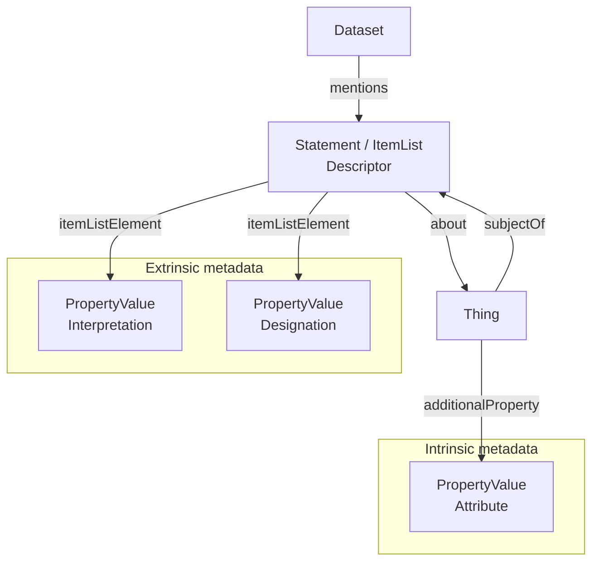

# Semantic Annotation profile

* Version: 0.1
<!-- * Permalink: <https://w3id.org/ro/wfrun/process/0.5> -->
* Authors
  * Lukas Weil - https://orcid.org/0000-0003-1945-6342
  * Florian Wetzels - https://orcid.org/0000-0002-5526-7138
  * Timo Mühlhaus - https://orcid.org/0000-0003-3925-6778
  * Christoph Garth - https://orcid.org/0000-0003-1669-8549
* License: [MIT License](https://mit-license.org/)
* Example conforming crate: [ro-crate-metadata.json](../../../examples/semantic_designation_crate/ro-crate-metadata.json)
* Profile Crate: [ro-crate-metadata.jsonld](ro-crate-metadata.jsonld)
* Extends:
  * [RO-Crate 1.2 specification](https://w3id.org/ro/crate/1.2)
* JSON-LD context: <https://www.researchobject.org/ro-terms/arc/context.jsonld>
* Vocabulary terms: <https://w3id.org/ro/terms/arc#>
* **Table of contents**
* [Semantic Annotation profile](#semantic-annotation-profile)
  * [Overview](#overview)
  * [Detailed Description](#detailed-description)
    * [Semantic Attributes](#semantic-attributes)
    * [Semantic Descriptors](#semantic-descriptors)
    * [Descriptor Items](#descriptor-items)
    * [Example Metadata File (`ro-crate-metadata.json`)](#example-metadata-file-ro-crate-metadatajson)
  * [Requirements](#requirements)
    * [Dataset](#dataset)
    * [Thing](#thing)
    * [Semantic Attribute](#semantic-attribute)
    * [Descriptor Item](#descriptor-item)
    * [Semantic Descriptor](#semantic-descriptor)

## Overview

This profile defines a general approach for attaching semantic metadata to entities represented in an RO-Crate. The described entity may be a **data entity**, such as a file, directory, or part of a file, or a **contextual entity**, such as a physical sample, instrument, or other object represented in the crate.

The profile distinguishes two structural forms of annotation according to how the annotated information is represented in relation to the described entity:

* An **Internal Annotation** models a property **of the entity**. The asserted information forms part of the description of the entity itself. For example, the mass of a sample may be represented directly as a property of that sample.

* An **External Annotation** models a statement **about the entity**. Rather than being incorporated directly into the entity's description, the assertion is represented separately and refers back to the entity it describes. For example, an External Annotation may state that a sample serves as a control in a particular experiment.

The distinction is therefore not primarily about what kind of information is expressed, but about how the annotation relates structurally to the described entity. The key structural difference is that an External Annotation uses a separate **annotation object** to represent the assertion, whereas an Internal Annotation expresses the assertion as part of the entity's description.

> **Note (for readers familiar with RDF):**
> This distinction is also reflected in the orientation of the annotation. In an Internal Annotation, the described entity is the *subject* of the relation expressing the attribute. In an External Annotation, the described entity is the *object* of a relation originating from the annotation object.

For readability, this profile refers to Internal Annotations as **Attributes**. External Annotations are implemented using **Descriptors**, which are separately represented resources that identify the entity being described and bundle one or more assertions about that entity into a single annotation. Because a Descriptor exists independently of the described entity, information about the annotation itself can also be expressed explicitly, such as its provenance, scope, or the circumstances under which it applies.

This structural difference becomes particularly important for context-dependent assertions. External Annotations can represent statements whose applicability depends on a particular activity, study, dataset, or other context without treating those statements as properties of the entity itself.

The profile uses the two annotation patterns for different kinds of metadata:

* **Intrinsic metadata** characterizes the entity itself, independently of a particular interpretation, role, or annotation context, for example the mass or size of a sample. Intrinsic metadata is represented through Internal Annotations, i.e. as Attributes.

* **Extrinsic metadata** adds meaning, classification, or contextual information to an entity from a particular descriptive perspective. This includes statements about what an entity represents as well as roles or classifications assigned to it. Extrinsic metadata is represented through External Annotations using Descriptors.

Extrinsic metadata is further divided according to the function and stability of the annotation:

* An **Interpretation** states what an entity, component, or value represents or means. For example, an Interpretation may state that a column in a table represents temperature measurements. Interpretations are generally intended to remain stable and valid independently of a particular experimental role, grouping, or other transient context.

* A **Designation** assigns a role, grouping, status, or other context-dependent classification to an entity. For example, a Designation may state that a sample serves as a control in a particular experiment. Designations are inherently context-dependent and may therefore change or cease to apply when the relevant activity, study, dataset, or other context changes.

Both Interpretations and Designations are therefore forms of extrinsic metadata expressed through External Annotations. They differ in their dependence on context: Interpretations are intended to express relatively stable meaning, whereas Designations express assignments whose validity depends on a particular context.

At the representation level, Attributes are expressed using `PropertyValue` objects linked directly from the described entity through `additionalProperty`. External Annotations are represented through Descriptors, which associate one or more assertions with the entity they describe and provide a place for contextual and provenance information about the annotation.


## Detailed Description

Within this profile, any entity that can be described in an RO-Crate may be semantically annotated. The described entity is referred to generally as a `Thing`.

Internal and External Annotations differ in how the annotated information is represented in relation to the described entity. Internal Annotations are represented as **Attributes**, which form part of the direct description of the entity. External Annotations are represented using **Descriptors**, which are separate annotation objects referring to the entity they describe.

### (Semantic) Attributes

Intrinsic metadata is represented using **Attributes**.

An Attribute is a `PropertyValue` object linked directly from the described entity through the `additionalProperty` property. It represents a property that is treated as belonging to the entity itself.

Each Attribute expresses a property and its value:

* `name`, and optionally `propertyID`, identify the property being described.
* `value`, and optionally `valueReference`, provide the value of that property.
* `unitText` and `unitCode` may specify the unit of the value where applicable.

For example, the mass of a sample may be represented by an Attribute whose property is `mass`, whose value is `2.3`, and whose unit is `g`.

### (Semantic) Descriptors

Extrinsic metadata is represented through **Descriptors**.

A Descriptor is a separately represented annotation object that identifies the entity being described and bundles one or more **Descriptor Items** about that entity into a single External Annotation. It is encoded as an object with the types `Statement` and `ItemList`.

The Descriptor:

* identifies the entity being described using `about`;
* contains its Descriptor Items using `itemListElement`; and
* may provide contextual or provenance information about the annotation, such as its creator, creation date, name, or description.

The described entity may link back to the Descriptor using `subjectOf`.

Because contextual and provenance information is associated with the Descriptor rather than with each contained item individually, multiple related assertions can share the same annotation-level metadata. This avoids repeating information such as the creator, creation time, or annotation context for every individual assertion.

A single entity may be described by multiple Descriptors. This allows different external annotations, potentially created in different contexts or by different annotators, to coexist independently.

The crate `Dataset` SHOULD reference Descriptors through the `mentions` property so that External Annotations are explicitly discoverable from the root dataset.

### Descriptor Items

A **Descriptor Item** represents one individual assertion contained in a Descriptor. Descriptor Items are represented as `PropertyValue` objects and express extrinsic metadata about the entity identified by the enclosing Descriptor.

Each Descriptor Item expresses a property and an assigned value:

* `name`, and optionally `propertyID`, identify the kind of statement being made, such as *physical quantity represented*, *experimental role*, or *replicate group*.
* `value`, and optionally `valueReference`, specify the value assigned for that property.

The kind of assertion represented by a Descriptor Item is indicated using `additionalType`:

* `Interpretation` indicates that the Descriptor Item states what an entity, component, or value represents or means.
* `Designation` indicates that the Descriptor Item assigns a context-dependent role, grouping, status, or classification.

For example, an Interpretation may state that a column in a file represents temperature, while a Designation may state that a sample serves as a control in a particular experiment.

For Interpretations, `unitText` and `unitCode` may additionally be used to specify the unit associated with the interpreted quantity. For example, if a file column is interpreted as representing temperature measurements, the Descriptor Item may indicate that the represented values are expressed in degrees Celsius.

This use of a unit differs from its use in an Attribute. In an Attribute, the unit qualifies the attribute value itself. In an Interpretation, the unit qualifies the quantity represented by the described entity or component.

A Descriptor may contain one or more Descriptor Items. All contained items describe the entity identified by the Descriptor's `about` property and share the contextual or provenance information recorded on that Descriptor.


```mermaid
flowchart TD

dataset[Dataset]
thing[Thing]

subgraph intrinsic["Intrinsic metadata"]
    attr[PropertyValue<br/>Attribute]
end

subgraph extrinsic["Extrinsic metadata"]
    interp[PropertyValue<br/>Interpretation]
    desig[PropertyValue<br/>Designation]
end

desc[Statement / ItemList<br/>Descriptor]

thing -- additionalProperty --> attr

thing -- subjectOf --> desc
desc -- about --> thing

desc -- itemListElement --> interp
desc -- itemListElement --> desig

dataset -- mentions --> desc
```

## Example Metadata File (`ro-crate-metadata.json`)

* [ro-crate-metadata.json](../../../examples/semantic_designation_crate/ro-crate-metadata.json)

```json
{
  "@context": [
    "https://w3id.org/ro/crate/1.2/context",
    {
      "Sample": "https://bioschemas.org/Sample"
    }
  ],
  "@graph": [
    {
      "@id": "./",
      "@type": "Dataset",
      "name": "Semantic Annotation Example",
      "mentions": [
        { "@id": "#semanticDescriptor1" },
        { "@id": "#semanticDescriptor2" }
      ]
    },
    {
      "@id": "#sample1",
      "@type": "Sample",
      "name": "Sample 1",
      "additionalProperty": {
        "@id": "#mass"
      },
      "subjectOf": {
        "@id": "#semanticDescriptor1"
      }
    },
    {
      "@id": "#semanticDescriptor1",
      "@type": [
        "Statement",
        "ItemList"
      ],
      "about": {
        "@id": "#sample1"
      },
      "itemListElement": [
        {
          "@id": "#controlGroupDesignation"
        }
      ]
    },
    {
      "@id": "#semanticDescriptor2",
      "@type": [
        "Statement",
        "ItemList"
      ],
      "about": {
        "@id": "measurements.csv"
      },
      "itemListElement": [
        {
          "@id": "#temperatureInterpretation"
        }
      ]
    },
    {
      "@id": "#mass",
      "@type": "PropertyValue",
      "name": "mass",
      "propertyID": "http://purl.obolibrary.org/obo/PATO_0000125",
      "value": 2.3,
      "unitText": "g",
      "unitCode": "http://purl.obolibrary.org/obo/UO_0000021"
    },
    {
      "@id": "#controlGroupDesignation",
      "@type": "PropertyValue",
      "additionalType": "Designation",
      "name": "experimental role",
      "propertyID": "TODO",
      "value": "control group",
      "valueReference": "http://purl.bioontology.org/ontology/MESH/D035061"
    },
    {
      "@id": "measurements.csv",
      "@type": "File",
      "name": "measurements.csv",
      "encodingFormat": "text/csv",
      "subjectOf": {
        "@id": "#semanticDescriptor2"
      }
    },
    {
      "@id": "#temperatureInterpretation",
      "@type": "PropertyValue",
      "additionalType": "Interpretation",
      "name": "physical quantity represented",
      "value": "temperature",
      "valueReference": "http://purl.obolibrary.org/obo/PATO_0000146",
      "unitText": "°C",
      "unitCode": "http://purl.obolibrary.org/obo/UO_0000027"
    },
    {
      "@id": "ro-crate-metadata.json",
      "@type": "CreativeWork",
      "conformsTo": {
        "@id": "https://w3id.org/ro/crate/1.2"
      },
      "about": {
        "@id": "./"
      }
    }
  ]
}
```

## Requirements

### Dataset

An RO-Crate `Dataset` containing semantically annotated entities.

| Property   | Required | Expected Type       | Description                                                                                                                                         |
| ---------- | -------- | ------------------- | --------------------------------------------------------------------------------------------------------------------------------------------------- |
| `@type`    | MUST     | [Text](https://schema.org/Text)                | MUST be [`schema.org/Dataset`](https://schema.org/Dataset).                                                                                             |
| `mentions` | SHOULD   | `[ "https://schema.org/Statement", "https://schema.org/ItemList" ]` | References Semantic Descriptors contained in the crate. Each referenced entity MUST follow the [Semantic Descriptor](#semantic-descriptor) profile. |

---

### Thing

An entity that is semantically described.

| Property             | Required | Expected Type                                              | Description                                                                                                                                                   |
| -------------------- | -------- | ---------------------------------------------------------- | ------------------------------------------------------------------------------------------------------------------------------------------------------------- |
| `additionalProperty` | COULD      | [`schema.org/PropertyValue`](https://schema.org/PropertyValue) | References intrinsic metadata of the entity. Each referenced `PropertyValue` MUST follow the [Semantic Attribute](#semantic-attribute) profile.               |
| `subjectOf`          | COULD      | `[ "https://schema.org/Statement", "https://schema.org/ItemList" ]` | References extrinsic metadata descriptions concerning the entity. Each referenced object MUST follow the [Semantic Descriptor](#semantic-descriptor) profile. |

---

### Semantic Attribute

A **Semantic Attribute** represents one item of intrinsic metadata about a `Thing`. It is represented as a `PropertyValue` and linked directly from the described entity through `additionalProperty`.

| Property         | Required | Expected Type            | Description                                                         |
| ---------------- | -------- | ------------------------ | ------------------------------------------------------------------- |
| `@id`            | MUST     | [Text](https://schema.org/Text) or [URL](https://schema.org/URL)              | Identifier of the attribute.                                        |
| `@type`          | MUST     | [Text](https://schema.org/Text)                     | MUST be [`schema.org/PropertyValue`](https://schema.org/PropertyValue). |
| `additionalType` | COULD      | [Text](https://schema.org/Text) or [URL](https://schema.org/URL)              | May further specialize the type of the attribute.                   |
| `name`           | MUST     | [Text](https://schema.org/Text)                     | Human-readable name of the represented property.                    |
| `propertyID`     | SHOULD   | [URL](https://schema.org/URL)                      | Ontology identifier or URI identifying the represented property.    |
| `value`          | SHOULD   | [Text](https://schema.org/Text) or [Number](https://schema.org/Number) or [Boolean](https://schema.org/Boolean) | Value of the represented property.                                  |
| `valueReference` | COULD      | [URL](https://schema.org/URL)                      | Ontology identifier or URI corresponding to the value.              |
| `unitText`       | COULD      | [Text](https://schema.org/Text)                     | Unit of the value, where applicable.                                |
| `unitCode`       | COULD      | [URL](https://schema.org/URL)                      | Ontology identifier or URI corresponding to `unitText`.             |
| `description`    | COULD      | [Text](https://schema.org/Text)                     | Additional information about the attribute.                         |

---

### Descriptor Item

A **Descriptor Item** represents one item of extrinsic metadata about a `Thing`. It is represented as a `PropertyValue` and contained in a [Semantic Descriptor](#semantic-descriptor).

A Descriptor Item is classified as either an **Interpretation** or a **Designation**.

| Property         | Required | Expected Type            | Description                                                                                                                             |
| ---------------- | -------- | ------------------------ | --------------------------------------------------------------------------------------------------------------------------------------- |
| `@id`            | MUST     | [Text](https://schema.org/Text) or [URL](https://schema.org/URL)              | Identifier of the assertion.                                                                                                            |
| `@type`          | MUST     | [Text](https://schema.org/Text)                     | MUST be [`schema.org/PropertyValue`](https://schema.org/PropertyValue).                                                                     |
| `additionalType` | SHOULD   | [Text](https://schema.org/Text) or [URL](https://schema.org/URL)              | Indicates the kind of assertion. SHOULD be either `Interpretation` or `Designation`.                                                    |
| `name`           | MUST     | [Text](https://schema.org/Text)                     | Human-readable name of the property being asserted, such as *physical quantity represented*, *experimental role*, or *replicate group*. |
| `propertyID`     | SHOULD   | [URL](https://schema.org/URL)                      | Ontology identifier or URI identifying the asserted property.                                                                           |
| `value`          | SHOULD   | [Text](https://schema.org/Text) or [Number](https://schema.org/Number) or [Boolean](https://schema.org/Boolean) | Value asserted for the property. May be a literal value or a human-readable label.                                                      |
| `valueReference` | COULD      | [URL](https://schema.org/URL)                      | Ontology identifier or URI corresponding to the asserted value.                                                                         |
| `unitText`       | COULD      | [Text](https://schema.org/Text)                     | Unit associated with the represented quantity, where applicable. Primarily intended for Interpretation assertions.                      |
| `unitCode`       | COULD      | [URL](https://schema.org/URL)                      | Ontology identifier or URI corresponding to `unitText`.                                                                                 |
| `description`    | COULD      | [Text](https://schema.org/Text)                     | Additional information about the assertion.                                                                                             |

An `Interpretation` SHOULD express meaning that is intended to remain stable independently of a particular experimental role, grouping, or transient context.

A `Designation` SHOULD express a role, grouping, status, or classification whose applicability depends on a particular activity, study, dataset, or other context.

---

### Semantic Descriptor

A **Semantic Descriptor** groups and qualifies one or more Descriptor Items concerning a `Thing`.

It is not itself an Interpretation or Designation. Instead, it establishes the subject and scope of its contained assertions and provides a place for contextual and provenance metadata concerning the annotation.

| Property          | Required | Expected Type                                                                                                   | Description                                                                                                                             |
| ----------------- | -------- | --------------------------------------------------------------------------------------------------------------- | --------------------------------------------------------------------------------------------------------------------------------------- |
| `@id`             | MUST     | [Text](https://schema.org/Text) or [URL](https://schema.org/URL)                                                     | Identifier of the descriptor.                                                                                                           |
| `@type`           | MUST     | [Text](https://schema.org/Text) array                                                                                                      | MUST contain both [`schema.org/Statement`](https://schema.org/Statement) and [`schema.org/ItemList`](https://schema.org/ItemList).              |
| `about`           | MUST     | [`schema.org/Thing`](https://schema.org/Thing)                                                                      | The entity described by the contained Descriptor Items.                                                                              |
| `itemListElement` | MUST     | [`schema.org/PropertyValue`](https://schema.org/PropertyValue)                                                      | References the contained Descriptor Items. Each referenced object MUST follow the [Descriptor Item](#descriptor-item) profile. |
| `creator`         | COULD      | [`schema.org/Person`](https://schema.org/Person), [`schema.org/Organization`](https://schema.org/Organization), or [Text](https://schema.org/Text) | Creator or annotator responsible for the contained assertions.                                                                          |
| `dateCreated`     | COULD      | [Date](https://schema.org/Date) or [DateTime](https://schema.org/DateTime)                                                                                                | Time at which the annotation was created.                                                                                               |
| `name`            | COULD      | [Text](https://schema.org/Text)                                                                                                            | Human-readable name of the descriptor.                                                                                                  |
| `description`     | COULD      | [Text](https://schema.org/Text)                                                                                                            | Additional information about the descriptor or annotation context.                                                                      |
